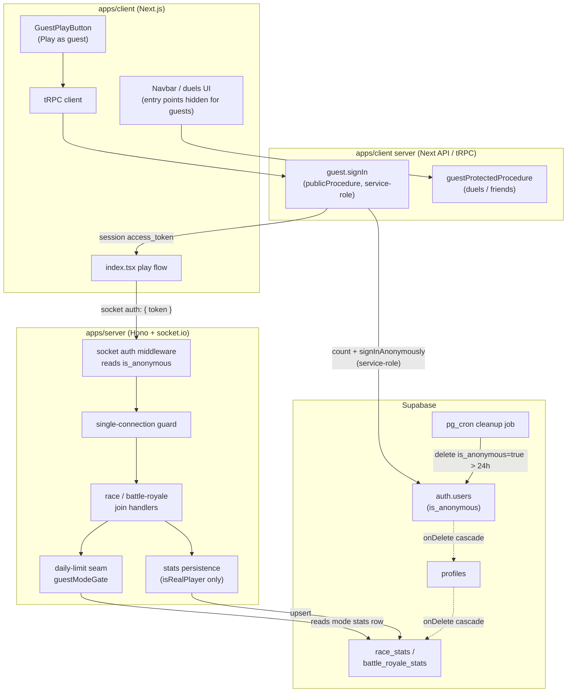
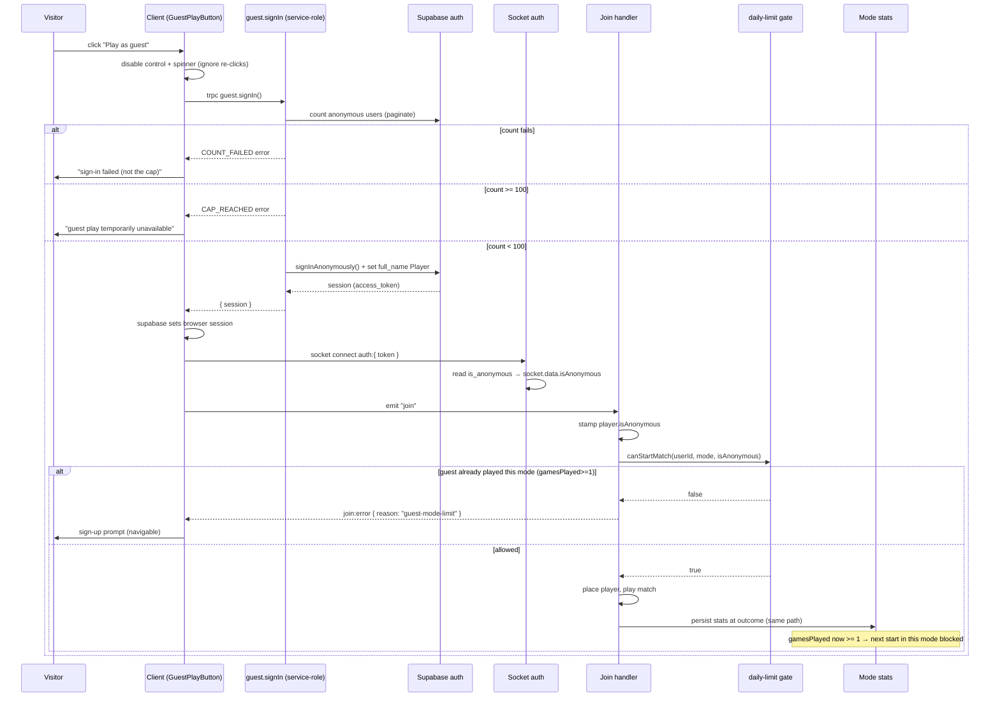
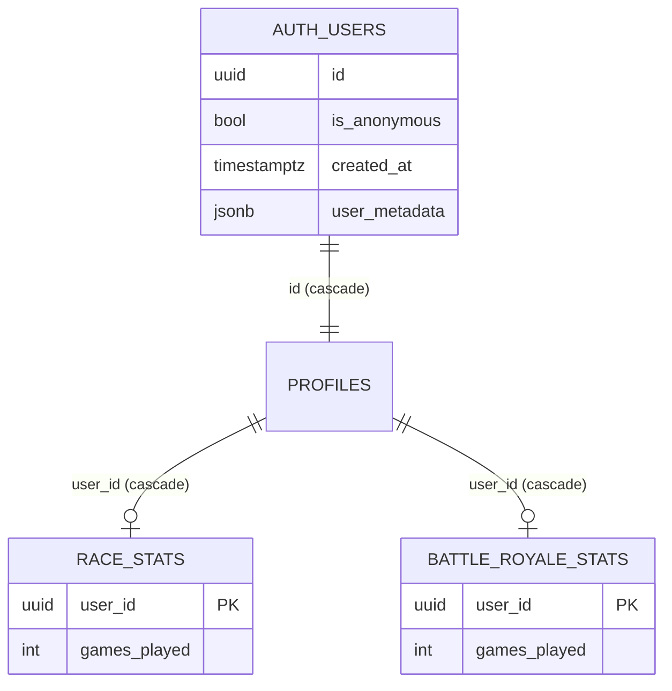

# Design Document

## Overview

This feature adds a low-friction "Play as guest" path on top of Supabase anonymous
sign-in. A visitor clicks one control, the server mints a temporary anonymous
Supabase account (a real UUID, no email, `is_anonymous = true`), and the client
authenticates the realtime socket with the returned access token through the
*existing* auth contract — no socket-auth protocol change.

Guests are deliberately sandboxed and temporary:

- **Capped** at 100 concurrent accounts (soft limit, enforced server-side with the
  service-role key).
- **Short-lived** — deleted after 24h by a Supabase `pg_cron` job (SQL artifact,
  not application code).
- **Limited** to one realtime game *per game mode* (one Race, one Battle Royale),
  derived from the per-mode stats row.
- **Sandboxed** out of social/persistent features (duels, friends) on both server
  and client.

Guests **do** persist stats through the exact same path as registered users. This
reverses an earlier "guests get no stats" idea: persisting is lower-friction, and
the per-mode stats row is reused as the single source of truth for the
one-game-per-mode gate (no separate in-progress tracking needed).

The feature is explicitly temporary. Every change is additive and lives behind a
clearly named seam, so the whole thing can be deleted in one pass (see
[Removability](#removability)) without touching registered-user flows.

### How the design maps to the requirements

| Requirement | Where it is realized in this design |
|---|---|
| R1 — Guest sign-in entry point | [Anon sign-in endpoint](#1-anonymous-sign-in-endpoint-trpc) + [`GuestPlayButton`](#6-client-guest-play-button--prompts) |
| R2 — Concurrent account cap | [`countAnonymousUsers` / cap check](#1-anonymous-sign-in-endpoint-trpc) + [Error Handling](#error-handling) |
| R3 — Guest display name | [`generateGuestDisplayName`](#2-guest-display-name-generator) + socket-auth name resolution |
| R4 — Server-side anonymous detection | [`resolveIsAnonymous` + socket-auth change](#3-socket-auth-anonymous-detection) + [join-handler stamp](#4-race--battle-royale-join-handler-stamp) |
| R5 — Guest stats persistence | [Stats path is unchanged](#5-stats-persistence-unchanged) — guests flow through `isRealPlayer` |
| R6 — One game per guest per mode | [`guestModeGate` behind the daily-limit seam](#7-one-game-per-mode-gate-daily-limit-seam) |
| R7 — Social/db features disabled | [`guestProtectedProcedure`](#8-guest-feature-gating-server--client) (server) + UI hiding (client) |
| R8 — Scheduled cleanup | [`pg_cron` SQL artifact](#pg_cron-cleanup-artifact) + onDelete cascade |
| R9 — Removable, isolated | [Removability](#removability) — every seam enumerated |

## Architecture

### System context



### Where the anon sign-in endpoint lives (tRPC vs Hono)

**Decision: a tRPC `publicProcedure` named `guest.signIn` in `apps/client`.**

Rationale, grounded in the real code:

- The service-role key already lives server-side in `apps/client` (socket auth on
  the game server uses `SUPABASE_SERVICE_ROLE_KEY`, and the Next API side can read
  the same env). The game server (`apps/server`, Hono) currently exposes only a
  socket layer and a trivial `GET /` — it has no HTTP request/response endpoints,
  no CORS-fronted JSON API, and no tRPC. Adding a sign-in HTTP route there would be
  net-new surface.
- Duels and friends are **already tRPC routers** in `apps/client`
  (`server/api/root.ts` → `duels`, `friends`). Putting guest sign-in in the same
  tRPC app keeps all client-facing server procedures in one place and reuses the
  existing `createTRPCContext` (which already builds a Supabase server client).
- The client already calls Supabase for the session before connecting the socket
  (`index.tsx` → `supabase.auth.getSession()`). After `guest.signIn` establishes a
  browser session, that *same* existing flow reads the session token and connects
  the socket — **zero change to the auth contract** (R1.4).

So: a new router `guestRouter` with a single `signIn` mutation, registered in
`appRouter`. It runs server-side only, uses a **service-role** Supabase admin
client (never the anon/cookie client), performs the cap count + `signInAnonymously`,
sets the display name, and returns the session.

### End-to-end flow



### Component map (new vs changed)

| Module | Status | Responsibility |
|---|---|---|
| `apps/client/src/server/api/routers/guest.ts` | **new** | `guest.signIn` mutation: cap count + anon sign-in + name |
| `apps/client/src/server/api/root.ts` | changed (one line) | register `guest` router |
| `apps/client/src/server/api/guest-cap.ts` | **new** | `countAnonymousUsers`, `ANON_ACCOUNT_CAP` |
| `apps/client/src/utils/guest-name.ts` | **new** | `generateGuestDisplayName` (pure) |
| `apps/client/src/components/guest/guest-play-button.tsx` | **new** | the "Play as guest" control + loading/error |
| `apps/client/src/hooks/useGuestSession.ts` | **new** | wraps the mutation + session handoff |
| `apps/server/src/socket/anonymous.ts` | **new** | `resolveIsAnonymous`, `ANON_DEFAULT` fail-safe |
| `apps/server/src/socket/auth.ts` | changed | set `socket.data.isAnonymous` |
| `apps/server/src/games/race/daily-limit.ts` | changed | `guestModeGate` branch in `canStartMatch` |
| `apps/server/src/games/battle-royale/daily-limit.ts` | **new** | mirror seam so BR is gated too |
| `apps/server/src/games/guest-mode-gate.ts` | **new** | shared per-mode stats read used by both seams |
| `apps/server/src/games/race/handlers.ts` | changed | stamp `player.isAnonymous`; pass mode+flag to gate |
| `apps/server/src/games/battle-royale/handlers.ts` | changed | call seam; stamp `player.isAnonymous` |
| `apps/client/src/server/api/trpc.ts` | changed | add `guestProtectedProcedure` |
| `apps/client/src/server/api/routers/duels.ts`, `friends.ts` | changed | swap `protectedProcedure` → `guestProtectedProcedure` |
| `supabase/migrations/*_guest_cleanup.sql` | **new artifact** | pg_cron cleanup (not app code) |

> All new modules carry a `guest`/`anon` identifier in their path or export names
> so the whole set is greppable and removable in one pass (R9.6).

## Components and Interfaces

### 1. Anonymous sign-in endpoint (tRPC)

`apps/client/src/server/api/routers/guest.ts`

```ts
// Discriminated result so the client can tell cap-rejection (R2.5) apart from
// count-failure / generic sign-in failure (R2.6, R1.7, R1.8).
export type GuestSignInError =
  | "CAP_REACHED"      // R2.3 — at/above 100 anonymous accounts
  | "COUNT_FAILED"     // R2.2 — could not count existing anon accounts
  | "SIGN_IN_FAILED";  // R1.8 — signInAnonymously() itself failed

export const guestRouter = createTRPCRouter({
  // publicProcedure: a guest has no session yet, so this must be callable
  // unauthenticated. All privileged work happens server-side with the
  // service-role client (R1.5).
  signIn: publicProcedure.mutation(async (): Promise<GuestSignInSession>) => {
    // 1. count anonymous accounts via the service-role admin client (R2.1)
    // 2. if count fails         -> throw TRPCError({ cause: "COUNT_FAILED" })
    // 3. if count >= cap (100)  -> throw TRPCError({ cause: "CAP_REACHED" })
    // 4. signInAnonymously() with service-role; on failure -> SIGN_IN_FAILED
    // 5. set user_metadata.full_name = generateGuestDisplayName()
    // 6. return { session } (non-empty access_token) — R1.3
  },
});

export type GuestSignInSession = {
  accessToken: string;   // guaranteed non-empty on success (R1.3)
  // minimal, no secrets beyond the session the browser needs
};
```

`apps/client/src/server/api/guest-cap.ts`

```ts
/** Soft cap on concurrent anonymous accounts (R2.3). */
export const ANON_ACCOUNT_CAP = 100;

/**
 * Count all accounts with is_anonymous === true by paginating the full
 * auth.users set with the service-role admin client (R2.1). Rejects (throws)
 * if any page fails so the caller can surface COUNT_FAILED distinctly (R2.2).
 */
export const countAnonymousUsers = async (
  admin: SupabaseClient,
): Promise<number> => { /* listUsers paginate, sum is_anonymous === true */ };
```

The soft-cap race (count-then-create is not atomic) is accepted per the brief;
see [Security](#security).

### 2. Guest display name generator

`apps/client/src/utils/guest-name.ts`

```ts
export const GUEST_NAME_PREFIX = "Player#";
export const GUEST_NAME_FALLBACK = "Player"; // R3.3, R3.4
const GUEST_NAME_ALPHABET = "ABCDEFGHIJKLMNOPQRSTUVWXYZ0123456789"; // [A-Z0-9]
const GUEST_NAME_MIN = 4;
const GUEST_NAME_MAX = 6;

/**
 * Pure. Returns `Player#` + 4–6 chars from [A-Z0-9] (R3.1). If the random
 * identifier ever comes out empty or outside the alphabet/length bounds, returns
 * the fallback "Player" rather than throwing (R3.4) — generation must never block
 * account creation. Not unique by design (R3.5).
 */
export const generateGuestDisplayName = (
  rng: () => number = Math.random,
): string => { /* ... */ };
```

Name resolution at socket connect (R3.2/R3.3) stays in socket auth: use
`user_metadata.full_name` when it has ≥1 non-whitespace char, else `"Player"`.
This is already the shape of the current code
(`user.user_metadata?.full_name ?? "Player"`); the change tightens it to also
reject whitespace-only names.

### 3. Socket auth: anonymous detection

`apps/server/src/socket/anonymous.ts` (new seam)

```ts
/** Fail-safe default: an unknown is_anonymous is treated as anonymous (R4.4). */
export const ANON_FAIL_SAFE = true;

/**
 * Read is_anonymous straight off the already-resolved Supabase user — no extra
 * DB query (R4.1). Missing / undefined / null -> true (R4.4).
 */
export const resolveIsAnonymous = (user: { is_anonymous?: boolean | null }): boolean =>
  user.is_anonymous == null ? ANON_FAIL_SAFE : user.is_anonymous === true;

/** Name resolution: full_name if it has a non-whitespace char, else "Player". */
export const resolveDisplayName = (user: {
  user_metadata?: { full_name?: unknown };
}): string => {
  const n = user.user_metadata?.full_name;
  return typeof n === "string" && n.trim().length > 0 ? n : "Player";
};
```

Change in `apps/server/src/socket/auth.ts` — after `getUser` resolves:

```ts
socket.data.userId = user.id;
socket.data.name = resolveDisplayName(user);        // R3.2, R3.3
socket.data.isAnonymous = resolveIsAnonymous(user); // R4.1–R4.4
```

`socket.data.isAnonymous` is added to the socket data type. No extra network/DB
call — `is_anonymous` is already on the `user` object from the single
`getUser(accessToken)` call.

### 4. Race & Battle Royale join-handler stamp

Both join handlers build a player record. Add `isAnonymous` from
`socket.data.isAnonymous` (R4.5, R4.6):

```ts
// race/handlers.ts (and the equivalent object in battle-royale/handlers.ts)
const player: RacePlayer = {
  name,
  isBot: false,
  isEliminated: false,
  // ...existing zeroed fields...
  isAnonymous: socket.data.isAnonymous, // R4.5 / R4.6
};
```

`isAnonymous` is added to `RacePlayer` / the Battle Royale player type.

### 5. Stats persistence (unchanged)

**No change to the stats path.** `stats.ts` already gates every write on
`isRealPlayer(userId)` (a UUID regex). Guests have real UUIDs, so they already
qualify. R5 is satisfied by the *absence* of any guest branch:

- `isRealPlayer(userId)` is the sole eligibility test (R5.1).
- Guests return `true` → eligible (R5.2).
- `persistRaceStats` / `persistLeaverAsLoss` / `persistEliminatedAsLoss` write the
  identical upsert for guests and registered users (R5.3–R5.5).
- Mixed matches persist both through the same path with no branch (R5.4).

The design's job here is to **confirm and lock in** that guests flow through
untouched — the removability requirement (R9.5) explicitly forbids adding any
guest branch to this path. The `isRealPlayer` UUID regex is duplicated today in
`stats.ts`, `handlers.ts`, and the BR equivalents; this feature does not change
that (keeping the diff additive), but the design treats `isRealPlayer` as the
single conceptual eligibility helper.

### 6. Client guest play button & prompts

`apps/client/src/components/guest/guest-play-button.tsx` +
`apps/client/src/hooks/useGuestSession.ts`

```ts
type UseGuestSession = {
  signInAsGuest: () => Promise<void>; // disables + spins while in flight (R1.6)
  isPending: boolean;
  error: null | "cap" | "other"; // drives the two distinct messages (R2.5/R2.6)
};
```

- While in flight: disable the control, show a spinner, ignore repeat activations
  (R1.6).
- A 5s client-side timeout: on timeout or failure, re-enable, drop the spinner,
  show an error, and **do not** connect the socket (R1.7).
- Success: hand the returned session to the existing `index.tsx` play flow, which
  reads the session token and connects the socket exactly as today (R1.4).
- `error === "cap"` → "guest play is temporarily unavailable" (R2.5);
  `error === "other"` → a generic "sign-in failed (not the cap)" message (R2.6).

A `GuestSignUpPrompt` component renders when a `join:error` with reason
`guest-mode-limit` arrives, offering a navigable action to `/sign-in` (R6.5).

### 7. One-game-per-mode gate (daily-limit seam)

The one-game-per-mode logic lives **behind the existing daily-limit seam** so all
match-start gating stays in one place (R9.4). A shared helper does the per-mode
stats read; each mode's `daily-limit.ts` calls it.

`apps/server/src/games/guest-mode-gate.ts` (new)

```ts
export type GameModeStatsTable = typeof raceStats | typeof battleRoyaleStats;

/**
 * Guest per-mode gate (R6.2, R6.3). Reads the guest's Mode_Stats row for the
 * given mode table. Returns true (ALLOW) when no row exists or gamesPlayed < 1;
 * false (BLOCK) when a row exists with gamesPlayed >= 1.
 * Fail-open: any DB error resolves to true so a stats outage never blocks play.
 */
export const guestModeGate = async (
  userId: string,
  table: GameModeStatsTable,
): Promise<boolean> => { /* select gamesPlayed where userId = $1 */ };

/** The error reason emitted to the client on a guest block (R6.3, R6.5). */
export const GUEST_MODE_LIMIT_REASON = "guest-mode-limit";
```

`apps/server/src/games/race/daily-limit.ts` — `canStartMatch` becomes mode- and
guest-aware (signature extended, call sites updated):

```ts
export const canStartMatch = async (
  userId: string,
  isAnonymous: boolean, // from socket.data.isAnonymous via the join handler
): Promise<boolean> => {
  // Registered users: never gated (R6.8) — preserves the dormant beta behavior.
  if (!isAnonymous) return true;
  // Guests: one game per mode, derived from this mode's stats row (R6.1–R6.4).
  return guestModeGate(userId, raceStats);
};
```

`apps/server/src/games/battle-royale/daily-limit.ts` — new, mirrors Race but reads
`battleRoyaleStats`. Battle Royale's join handler does **not** currently consult a
daily-limit seam, so this feature introduces the seam call in BR's `join` (additive)
so the one-game-per-mode rule covers both modes.

Join handlers, on a block:

```ts
const permitted = await canStartMatch(userId, socket.data.isAnonymous);
if (!permitted) {
  socket.emit("join:error", {
    reason: socket.data.isAnonymous ? GUEST_MODE_LIMIT_REASON : "daily-limit",
  });
  return; // not placed into any lobby
}
```

Because the gate reads the *mode's own* stats table, a guest blocked in Race can
still start Battle Royale and vice versa (R6.4). Mid-game concurrency is handled by
the existing `single-connection.ts` guard (R6.6); a disconnect/leave records a
leaver-loss via `persistLeaverAsLoss`, which writes `gamesPlayed >= 1` and so blocks
the next start in that mode (R6.7) — no separate in-progress tracking.

### 8. Guest feature gating (server + client)

**Server** — `apps/client/src/server/api/trpc.ts`:

```ts
/**
 * Like protectedProcedure, but additionally rejects anonymous (guest) users
 * BEFORE any resolver runs, so no persisted duel/friends state is read or
 * written for a guest (R7.1, R7.2). Used by the duels and friends routers.
 */
export const guestProtectedProcedure = protectedProcedure.use(({ ctx, next }) => {
  if (ctx.user.is_anonymous === true) {
    throw new TRPCError({ code: "FORBIDDEN", message: "Guests cannot use this feature" });
  }
  return next();
});
```

`duelsRouter` and `friendsRouter` swap every `protectedProcedure` for
`guestProtectedProcedure`. Registered users are unaffected (R7.6); the guard throws
before any DB access, so no state is touched for a guest (R7.1, R7.2).

**Client** — hide duels/friends entry points while a guest session is active
(R7.3, R7.4):

- `Navbar` reads `useAuthStore().user?.is_anonymous`; when true, the **Friends**
  link is not rendered.
- The home screen's `HeadToHeadCard` (duels entry point) is not rendered for a
  guest; the realtime game cards (Battle Royale, Race) remain — the single
  permitted exception (R7.5).

The `auth-store` already holds the Supabase `User`; `is_anonymous` is a field on it,
so no new fetch is needed. A small `useIsGuest()` selector centralizes the read so
removal is one edit.

## Data Models

No new tables. The feature reuses existing schema (`packages/db/src/schema.ts`):

- `auth.users` (Supabase-managed) — source of `is_anonymous`, `created_at`,
  `user_metadata.full_name`. Not a Drizzle table; read via the admin API and
  deleted by `pg_cron`.
- `profiles` — mirrors `auth.users` (populated by trigger), `id` FK target with
  `onDelete: cascade`.
- `race_stats` / `battle_royale_stats` — one row per `userId` (PK), FK to
  `profiles.id` with `onDelete: cascade`, carrying the `gamesPlayed` counter the
  gate reads.

Cascade chain used by cleanup (R8.5): deleting an `auth.users` row removes its
`profiles` row (cascade), which removes its `race_stats` / `battle_royale_stats`
rows (cascade). No separate stats-deletion statement is needed (R8.6).



New in-memory / transient shapes (not persisted):

- `socket.data.isAnonymous: boolean` — per-connection flag.
- `RacePlayer.isAnonymous` / BR player `isAnonymous` — per-match flag on the player
  record.
- `GuestSignInSession` / `GuestSignInError` — endpoint I/O types.

## Correctness Properties

*A property is a characteristic or behavior that should hold true across all valid
executions of a system — essentially, a formal statement about what the system
should do. Properties serve as the bridge between human-readable specifications and
machine-verifiable correctness guarantees.*

Each property below is universally quantified and maps to one or more acceptance
criteria. Pure, input-varying logic (name generation, the anonymous truth table,
stats eligibility, the per-mode gate decision, the cap boundary, the counting
function, and the cleanup predicate) is where property-based testing earns its
keep. Wiring, UI rendering, scheduling, and cascade behavior are covered by
example/integration/smoke tests instead (see [Testing Strategy](#testing-strategy)).

### Property 1: Anonymous resolution truth table

*For any* value of `is_anonymous` on a resolved user — `true`, `false`,
`undefined`, `null`, or absent — `resolveIsAnonymous(user)` returns `false` exactly
when the value is strictly `false`, and `true` in every other case (including the
nullish fail-safe default).

**Validates: Requirements 4.2, 4.3, 4.4**

### Property 2: Display-name generator is total and well-formed

*For any* random number generator (including adversarial sequences),
`generateGuestDisplayName(rng)` never throws and its output either matches
`^Player#[A-Z0-9]{4,6}$` or equals the fallback `"Player"` — never an empty string
and never a value outside the alphabet/length bounds.

**Validates: Requirements 3.1, 3.4**

### Property 3: Display-name resolution prefers a non-blank full_name

*For any* `full_name` input, `resolveDisplayName` returns that string when it
contains at least one non-whitespace character, and returns `"Player"` for every
absent, empty, or whitespace-only input.

**Validates: Requirements 3.2, 3.3**

### Property 4: Anonymous count is correct regardless of pagination

*For any* set of auth users partitioned into pages of arbitrary sizes,
`countAnonymousUsers` returns a count equal to the number of users with
`is_anonymous === true`, independent of where the page boundaries fall.

**Validates: Requirements 2.1**

### Property 5: Counting failure never creates an account and is distinctly reported

*For any* page-fetch failure encountered while counting, the sign-in endpoint makes
no account-creation call and surfaces a `COUNT_FAILED` error that is distinguishable
from the `CAP_REACHED` error.

**Validates: Requirements 2.2**

### Property 6: Cap boundary governs account creation at 100

*For any* current anonymous count `n`, the endpoint creates exactly one account when
`n < 100` and creates no account while returning a distinguishable `CAP_REACHED`
error when `n >= 100`.

**Validates: Requirements 2.3, 2.4**

### Property 7: Sign-in result carries a token exactly on success

*For any* outcome of the underlying `signInAnonymously` call, the endpoint returns a
success containing a non-empty access token when and only when sign-in succeeded;
every failure returns a `SIGN_IN_FAILED` error and no access token (a token-less
"success" from the provider is treated as a failure).

**Validates: Requirements 1.3, 1.8**

### Property 8: Stats eligibility is `isRealPlayer` alone

*For any* player id (real UUID or bot key) and *for any* value of the player's
`isAnonymous` flag, stats-persistence eligibility equals `isRealPlayer(id)` — the
`isAnonymous` flag has zero effect on eligibility.

**Validates: Requirements 5.1, 5.2**

### Property 9: Persisted stats are independent of guest status

*For any* match outcome (`win`, `loss`, `leaver`, `eliminated`) and otherwise
identical match inputs, the stats row persisted for a player is identical whether
that player is flagged as a guest or a registered user.

**Validates: Requirements 5.3, 5.4, 5.5**

### Property 10: Guest per-mode gate decision

*For any* guest and *for any* state of that guest's `Mode_Stats` row in a mode, the
gate permits the start when no row exists or the row's `gamesPlayed < 1`, and blocks
the start — causing the join flow to emit an error whose reason is
`guest-mode-limit` — when a row exists with `gamesPlayed >= 1`.

**Validates: Requirements 6.1, 6.3**

### Property 11: Per-mode gating is independent across modes

*For any* pair of per-mode stats states `(raceGamesPlayed, brGamesPlayed)`, the
Race gate decision depends only on `raceGamesPlayed` and the Battle Royale gate
decision depends only on `brGamesPlayed`; a block in one mode never changes the
decision in the other.

**Validates: Requirements 6.4**

### Property 12: Registered users bypass the gate without reading stats

*For any* `Mode_Stats` state, a non-anonymous (registered) user is permitted to
start and the gate performs no `Mode_Stats` read for that user.

**Validates: Requirements 6.8**

### Property 13: Cleanup predicate selects only aged anonymous accounts

*For any* set of accounts with mixed `is_anonymous` values (`true` / `false` /
`null`) and arbitrary `created_at` timestamps, the cleanup predicate selects for
deletion exactly those accounts where `is_anonymous = true` AND age `> 24h`, and
never selects any account where `is_anonymous` is `false` or `null`.

**Validates: Requirements 8.2**

> Properties intentionally **not** written (covered by other test types, per the
> prework): R1.1/1.6/1.7/2.5/2.6/3.5/4.5/4.6/6.5/6.7/7.3/7.4/7.5/7.6/8.1 (UI/example),
> R1.2/1.4/1.5/4.1/6.2/6.6/7.1/7.2/8.5/8.7 (integration/wiring), and
> R8.3/8.4/8.6/9.1–9.6 (smoke/architecture).

## Error Handling

### Sign-in endpoint error taxonomy

The endpoint returns three mutually distinguishable failure kinds so the client can
branch correctly:

| Kind | Trigger | Account created? | Client message |
|---|---|---|---|
| `COUNT_FAILED` | Counting anonymous users failed/incomplete (R2.2) | No | Non-cap failure message (R2.6) |
| `CAP_REACHED` | Count `>= 100` (R2.3) | No | "Guest play temporarily unavailable" (R2.5) |
| `SIGN_IN_FAILED` | `signInAnonymously` itself failed (R1.8) | No token returned | Non-cap failure message (R2.6) |

The order of checks matters: **count → cap → create**. A count failure short-circuits
before the cap comparison (so a transient listing error is never misreported as a cap
rejection), and the cap check short-circuits before `signInAnonymously` (so no account
is minted at the ceiling).

### Client sign-in UX errors

- **In-flight guard (R1.6):** the control is disabled and shows a spinner while the
  mutation is pending; repeat activations are ignored until it resolves.
- **Timeout/failure (R1.7):** a 5-second client timeout (and any thrown error)
  re-enables the control, removes the spinner, shows an error, and crucially does
  **not** connect the socket. The socket is only connected after a *successful*
  session handoff.

### Join-time guest-mode rejection

When the gate blocks a guest, the join handler emits
`join:error { reason: "guest-mode-limit" }` and does not place the player into any
lobby. The client maps this reason to the sign-up prompt (R6.5). This reuses the
existing `join:error` channel already handled by `useRaceSocket`; the only new value
is the `guest-mode-limit` reason (Battle Royale gains the same `join:error` emission).

### Fail-open vs fail-safe

Two deliberately opposite defaults, each chosen for safety in its context:

- **Gate reads fail *open* (`guestModeGate`)** — if the `Mode_Stats` read errors, the
  gate resolves to ALLOW. This matches the existing `daily-limit.ts` fail-open policy:
  a stats-store outage must never block play or crash the game loop. Worst case, a
  guest gets an extra game — acceptable for a temporary feature.
- **Anonymity resolves fail *safe* (`resolveIsAnonymous`)** — a missing/unknown
  `is_anonymous` is treated as `true` (guest). Worst case, a registered user is
  briefly over-restricted (sandboxed), which is strictly safer than accidentally
  granting a guest social/persistent access.

### Cleanup failure

The `pg_cron` job runs as a single statement/transaction: if it fails, no rows are
deleted and the failure is recorded in `cron.job_run_details` (R8.7). No application
code observes or retries it.

## Security

- **Service-role key stays server-side (R1.5).** `guest.signIn` runs only in the
  Next.js server (tRPC resolver) using a Supabase **admin** client built from
  `SUPABASE_SERVICE_ROLE_KEY`. The key is never shipped to the browser and never used
  by the anon/cookie client. Counting (`admin.auth.admin.listUsers`) and
  `signInAnonymously` both happen there.
- **`is_anonymous` is read from the verified user, not client input.** The socket
  layer and `guestProtectedProcedure` both read `is_anonymous` from the user object
  resolved by Supabase from a verified JWT (`getUser`), so a client cannot spoof
  non-guest status. No extra DB lookup is performed (R4.1).
- **Soft-cap race acknowledged.** Count-then-create is not atomic, so brief bursts can
  overshoot 100 slightly. This is accepted per the brief for a soft cap; the 24h
  `pg_cron` cleanup bounds total accumulation regardless. If a hard cap were ever
  needed, a DB-side unique/counter constraint would replace the application count — out
  of scope here.
- **Guests cannot touch durable data.** `guestProtectedProcedure` throws before any
  resolver/DB access on duels/friends (R7.1, R7.2); the only durable writes a guest
  performs are their own `Mode_Stats` rows via the shared stats path, which are reaped
  by cleanup.
- **No new secrets in the client.** The guest session returned to the browser is a
  normal Supabase session; nothing privileged beyond what any signed-in session holds.

## Testing Strategy

### Dual approach

- **Property-based tests** verify the 13 universal properties above across randomized
  inputs. Use **`fast-check`** (the standard property library for this TS/Vitest
  codebase — the repo already runs Vitest, e.g. `battle-royale/stats.test.ts`). Do
  **not** hand-roll property testing.
  - Minimum **100 iterations** per property test (fast-check `numRuns: 100`).
  - Each property test is tagged with a comment referencing its design property, in
    the form: `// Feature: anonymous-sign-in, Property N: <property text>`.
  - Implement each correctness property with a **single** property-based test.
- **Example-based unit tests** cover specific UI states, error-message mapping, and
  flag propagation: R1.1, R1.6, R1.7, R2.5, R2.6, R3.5, R4.5/4.6 (stamp propagation),
  R6.5, R7.3/7.4/7.5/7.6, and the SQL age predicate shape (R8.1).
- **Integration tests** (1–3 representative cases each) cover wiring and
  infrastructure that does not vary meaningfully with input: service-role usage and
  endpoint wiring (R1.2, R1.4, R1.5), no-extra-query auth read (R4.1), per-mode table
  selection (R6.2), the single-connection guard for guests (R6.6), the guest/leaver
  → next-start-blocked sequence (R6.7), duels/friends rejection with zero DB access
  (R7.1, R7.2), and the onDelete cascade + cleanup-failure atomicity against a seeded
  DB (R8.5, R8.7).
- **Smoke/architecture checks** cover scheduling and removability: cron cadence and
  "no app-code cleanup" (R8.3, R8.4, R8.6) and the isolation/grep requirements
  (R9.1–R9.6).

### Property → test library mapping

| Property | Pure unit under test | Library |
|---|---|---|
| 1 | `resolveIsAnonymous` | fast-check |
| 2 | `generateGuestDisplayName` | fast-check |
| 3 | `resolveDisplayName` | fast-check |
| 4 | `countAnonymousUsers` (paged, mocked admin) | fast-check |
| 5 | endpoint count-failure path (mocked admin) | fast-check |
| 6 | endpoint cap boundary (mocked admin) | fast-check |
| 7 | endpoint token-present-iff-success (mocked admin) | fast-check |
| 8 | eligibility == `isRealPlayer` | fast-check |
| 9 | `upsertPlayerStat` input row (flag-independent) | fast-check |
| 10 | `guestModeGate` decision (mocked stats read) | fast-check |
| 11 | cross-mode gate independence (mocked stats read) | fast-check |
| 12 | registered bypass (spy: no read) | fast-check |
| 13 | cleanup predicate as a filter function | fast-check |

For Property 13, model the SQL `WHERE` clause as a pure TS filter
(`is_anonymous === true && ageHours > 24`) and property-test that filter; back it
with one integration test running the real SQL against a seeded database so the SQL
and the model cannot drift.

### Regression safety (R9.2/9.3)

The pre-existing suite (socket auth, race/battle-royale handlers and stats, duels,
friends) must pass unchanged with the feature in place, and — per R9.2 — must pass
again after the feature is removed. New guest tests live in clearly named files
(`*guest*`, `*anon*`) so they are deleted alongside the feature.

## Removability

Every added surface carries a `guest`/`anon` identifier so a repo-wide search finds
all of it (R9.6). Removal is a delete-plus-revert pass:

**Delete these new files entirely:**

- `apps/client/src/server/api/routers/guest.ts`
- `apps/client/src/server/api/guest-cap.ts`
- `apps/client/src/utils/guest-name.ts`
- `apps/client/src/components/guest/guest-play-button.tsx`
- `apps/client/src/components/guest/guest-sign-up-prompt.tsx`
- `apps/client/src/hooks/useGuestSession.ts`
- `apps/server/src/socket/anonymous.ts`
- `apps/server/src/games/guest-mode-gate.ts`
- `apps/server/src/games/battle-royale/daily-limit.ts`
- `supabase/migrations/*_guest_cleanup.sql` (and drop the cron job)

**Revert these additive edits (each is a single, localized block):**

- `root.ts` — remove the `guest` router registration (one line).
- `socket/auth.ts` — remove the `socket.data.isAnonymous = resolveIsAnonymous(user)`
  line (and revert `resolveDisplayName` to the inline `?? "Player"` if desired).
- `race/daily-limit.ts` — restore `canStartMatch` to the dormant always-`true` body
  and drop the `isAnonymous` parameter.
- `race/handlers.ts` & `battle-royale/handlers.ts` — remove the `isAnonymous` stamp on
  the player record and the guest-reason `join:error` branch; BR also drops the
  newly-added `canStartMatch` call.
- `trpc.ts` — remove `guestProtectedProcedure`.
- `duels.ts` / `friends.ts` — swap `guestProtectedProcedure` back to
  `protectedProcedure`.
- `Navbar` / home screen — remove the `useIsGuest()` conditional around the
  friends/duels entry points and the guest play button.

**Isolation guarantees enforced by the design:**

- Match-start gating is confined to the daily-limit seam + `guestModeGate`; removing
  them disables one-game-per-mode with **no** edit to Match or Round logic (R9.4).
- The stats path and `isRealPlayer` contain **no** `isAnonymous` branch, so removing
  guest code leaves stats persistence byte-for-byte unchanged for every real player
  (R9.5) — Property 8 and Property 9 are precisely this isolation, stated as behavior.
- After removal, a grep for `guest`, `isAnonymous`, `guestModeGate`,
  `guestProtectedProcedure`, `generateGuestDisplayName`, `resolveIsAnonymous`,
  `guest-mode-limit`, and `countAnonymousUsers` returns no matches outside removed
  files (R9.6).

## pg_cron Cleanup Artifact

Delivered as an installable SQL migration under `supabase/migrations/` (NOT
application code, R8.4). It schedules a job that, every 24 hours, deletes anonymous
`auth.users` rows older than 24 hours. Deletion cascades through `profiles` →
`race_stats` / `battle_royale_stats` via the existing `onDelete: cascade` FKs
(R8.5), so there is **no** explicit stats-deletion statement (R8.6). A failing run
leaves all rows intact and is recorded in `cron.job_run_details` (R8.7).

```sql
-- supabase/migrations/<timestamp>_guest_cleanup.sql
-- Scheduled cleanup of aged anonymous (guest) accounts.
-- Requires the pg_cron extension (available on Supabase).

create extension if not exists pg_cron;

-- Deletes anonymous auth.users older than 24h. ONLY is_anonymous = true is
-- touched; false/null are never selected (R8.2). The cascade on profiles ->
-- *_stats removes guest stats automatically (R8.5/R8.6); no stats DELETE here.
create or replace function public.cleanup_anonymous_accounts()
returns void
language sql
security definer
set search_path = public
as $$
  delete from auth.users
  where is_anonymous = true
    and now() - created_at > interval '24 hours';
$$;

-- Idempotent (re)scheduling: unschedule any prior copy, then schedule to run
-- every 24 hours (R8.3). A failed run is recorded in cron.job_run_details (R8.7)
-- and, because the DELETE is a single atomic statement, deletes nothing on error.
do $$
begin
  perform cron.unschedule('cleanup_anonymous_accounts')
  where exists (
    select 1 from cron.job where jobname = 'cleanup_anonymous_accounts'
  );
end
$$;

select cron.schedule(
  'cleanup_anonymous_accounts',
  '0 0 * * *',                       -- every 24h (daily at 00:00 UTC)
  $$select public.cleanup_anonymous_accounts();$$
);
```

> The `0 0 * * *` daily schedule satisfies "every 24 hours" (R8.3). If an exact
> 24h-from-install cadence is preferred over a fixed wall-clock time, swap the cron
> expression for an interval-based schedule; the delete predicate is unchanged.
