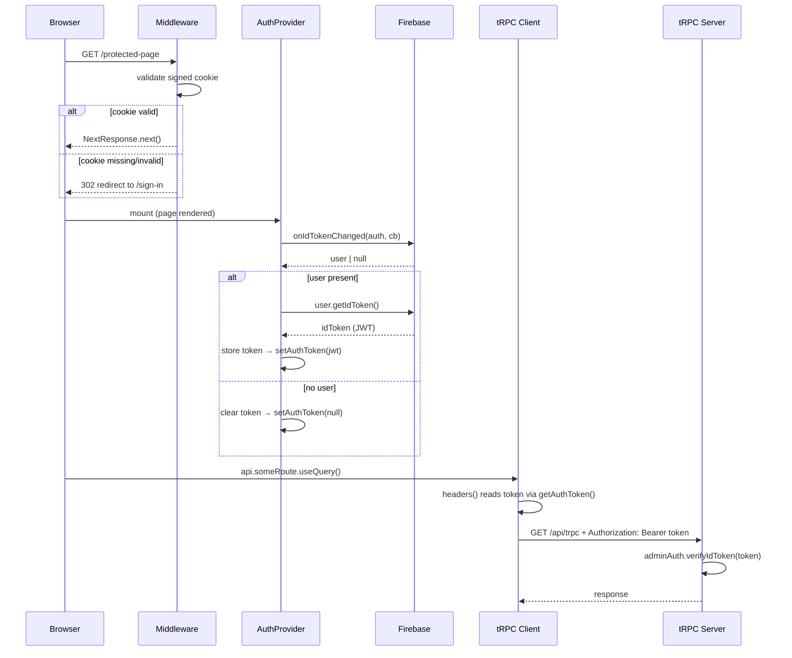
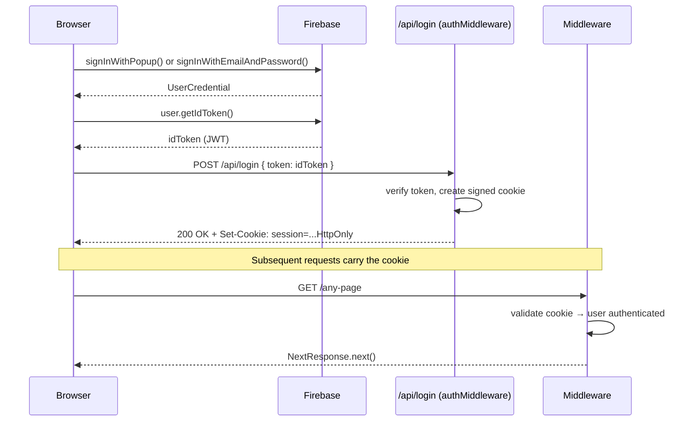

# Design Document: Firebase Auth Client

## Overview

This feature adds a complete Firebase Authentication integration to the Next.js app. It introduces a React auth context/provider, Google Sign-In (and email/password) on the sign-in page, automatic Bearer token injection into tRPC calls, and server-side route protection via `next-firebase-auth-edge` middleware. The existing Firebase client SDK (`auth` from `utils/firebase/client.ts`) and the tRPC server-side token verification (`adminAuth.verifyIdToken` in `trpc.ts`) are already in place — this design connects the two ends.

Route protection runs entirely server-side via `middleware.ts` using `authMiddleware` from `next-firebase-auth-edge`. On sign-in, the client POSTs the Firebase ID token to `/api/login`, which `authMiddleware` intercepts to set a signed HttpOnly cookie. On every subsequent request, the middleware validates that cookie and redirects unauthenticated users to `/sign-in` (or authenticated users away from `/sign-in` to `/`) before the page ever renders — eliminating client-side HOC flicker entirely.

The `AuthProvider` still exists for client-side user state (so components can read `user` and call `signOut`), but it no longer drives redirects. The tRPC Bearer token injection via `setAuthToken`/`getAuthToken` in `api.ts` remains unchanged.

---

## Architecture

```mermaid
graph TD
    A[Incoming Request] --> B[middleware.ts — authMiddleware]
    B -->|valid cookie + path = /sign-in| C[redirect to /]
    B -->|valid cookie + other path| D[NextResponse.next]
    B -->|no/invalid cookie + protected path| E[redirect to /sign-in]
    B -->|no/invalid cookie + /sign-in| F[NextResponse.next]

    D --> G[Page renders]
    G --> H[_app.tsx — AuthProvider wraps tree]
    H --> I[Component tree]

    H -->|exposes| J[useAuth hook]
    J --> K[sign-in.tsx]
    J --> L[Protected pages]

    H -->|token ref| M[api.ts tRPC client]
    M -->|Authorization: Bearer token| N[/api/trpc]
    N --> O[createTRPCContext → adminAuth.verifyIdToken]

    subgraph Cookie Flow
      K -->|signInWithPopup / signInWithEmailAndPassword| P[Firebase SDK]
      P -->|getIdToken| Q[POST /api/login with token]
      Q -->|authMiddleware sets signed HttpOnly cookie| R[Cookie stored]
      L -->|sign out button| S[POST /api/logout]
      S -->|authMiddleware clears cookie| T[Cookie cleared]
      T --> U[Firebase client signOut]
    end
```





---

## Components and Interfaces

### `middleware.ts` (`src/middleware.ts`)

**Purpose**: Intercepts every page request before rendering. Uses `authMiddleware` from `next-firebase-auth-edge` to validate the signed session cookie and redirect accordingly. Also handles the `/api/login` and `/api/logout` endpoints automatically.

**Interface**:
```typescript
import { authMiddleware } from 'next-firebase-auth-edge'
import type { NextRequest } from 'next/server'

export async function middleware(request: NextRequest): Promise<Response>

export const config = {
  matcher: [
    '/',
    '/((?!_next|favicon.ico|.*\\..*).*)',
  ],
}
```

**Redirect logic**:
- `handleValidToken`: if `request.nextUrl.pathname === '/sign-in'` → redirect to `/`; otherwise `NextResponse.next()`
- `handleInvalidToken`: if `request.nextUrl.pathname !== '/sign-in'` → redirect to `/sign-in`; otherwise `NextResponse.next()`
- `handleError`: same as `handleInvalidToken` (treat errors as unauthenticated)

**Responsibilities**:
- Validate the signed HttpOnly session cookie on every matched request
- Redirect unauthenticated users away from protected pages to `/sign-in`
- Redirect authenticated users away from `/sign-in` to `/`
- Expose `/api/login` endpoint: receives `{ token }` in request body, verifies the Firebase ID token, sets a signed HttpOnly cookie
- Expose `/api/logout` endpoint: clears the session cookie

---

### AuthProvider (`src/contexts/auth.tsx`)

**Purpose**: Wraps the entire app. Listens to Firebase `onIdTokenChanged`, keeps the decoded user and raw token in state, and exposes them via context. Also holds a `tokenRef` (mutable ref) that the tRPC client reads synchronously in its `headers()` callback. Does NOT drive redirects — that is handled by middleware.

**Interface**:
```typescript
interface AuthContextValue {
  user: User | null          // firebase/auth User object
  token: string | null       // raw Firebase ID token (JWT)
  loading: boolean           // true until first auth state resolved
  signInWithGoogle: () => Promise<void>
  signInWithEmail: (email: string, password: string) => Promise<void>
  signOut: () => Promise<void>
}

const AuthContext: React.Context<AuthContextValue>

function AuthProvider({ children }: { children: React.ReactNode }): JSX.Element

function useAuth(): AuthContextValue  // throws if used outside AuthProvider
```

**Responsibilities**:
- Subscribe to `onIdTokenChanged` on mount, unsubscribe on unmount
- On each token change, call `user.getIdToken()` and update both `token` state and `tokenRef.current`; call `setAuthToken(token)` for tRPC
- Expose `signInWithGoogle`: calls `signInWithPopup`, then POSTs the ID token to `/api/login` to set the session cookie
- Expose `signInWithEmail`: calls `signInWithEmailAndPassword`, then POSTs the ID token to `/api/login`
- Expose `signOut`: POSTs to `/api/logout` to clear the cookie, then calls Firebase client `signOut(auth)`
- No redirect logic — middleware handles all route protection

---

### Updated `api.ts` (tRPC client)

**Purpose**: Inject the Firebase ID token as a Bearer header on every tRPC request. Unchanged from the original design.

```typescript
// Exported setter called by AuthProvider
export function setAuthToken(token: string | null): void

// Used internally by httpBatchLink headers()
function getAuthToken(): string | null
```

The `AuthProvider` calls `setAuthToken(token)` whenever the token changes (including on sign-out).

---

### Updated Sign-In Page (`src/pages/sign-in.tsx`)

**Purpose**: Replace the placeholder with a real sign-in form. No longer wrapped with `withGuest` — the middleware handles redirecting authenticated users away from `/sign-in`.

**Interface**:
```typescript
// No props — reads from useAuth()
const SignIn: NextPage
```

**Responsibilities**:
- Render a Google Sign-In button (calls `signInWithGoogle()`)
- Render an email/password form (calls `signInWithEmail(email, password)`)
- Display inline error messages on auth failure
- Show a loading state while sign-in is in progress
- No HOC wrapping needed — middleware redirects authenticated users before the page renders

---

## Data Models

### AuthState (internal to AuthProvider)

```typescript
type AuthState = {
  user: User | null    // firebase/auth User
  token: string | null // raw ID token JWT
  loading: boolean
}
```

### Session Cookie

Managed entirely by `next-firebase-auth-edge`. The cookie is:
- Signed with `COOKIE_SIGNATURE_KEY_CURRENT` / `COOKIE_SIGNATURE_KEY_PREVIOUS`
- HttpOnly — not accessible to JavaScript
- Contains the Firebase session; validated on every request in middleware

### Token lifecycle

```
Sign-in:
  signInWithPopup / signInWithEmailAndPassword succeeds
  → user.getIdToken() → JWT
  → POST /api/login { token: JWT }
  → authMiddleware sets signed HttpOnly cookie
  → onIdTokenChanged fires → AuthProvider stores JWT → setAuthToken(JWT)

Token refresh (automatic, every ~60 min):
  onIdTokenChanged fires with refreshed user
  → user.getIdToken() → new JWT
  → setAuthToken(newJWT) (tRPC picks it up)
  Note: cookie is refreshed by authMiddleware on subsequent requests automatically

Sign-out:
  POST /api/logout → authMiddleware clears cookie
  → Firebase client signOut(auth)
  → onIdTokenChanged fires with null → setAuthToken(null)
```

---

## Key Functions with Formal Specifications

### `middleware` — `handleValidToken` callback

```typescript
function handleValidToken(
  tokens: { token: string; decodedToken: DecodedIdToken },
  headers: Headers
): NextResponse | Promise<NextResponse>
```

**Preconditions:**
- Cookie is present and signature is valid
- `tokens.decodedToken` is a verified Firebase ID token payload

**Postconditions:**
- If `pathname === '/sign-in'`: returns a redirect response to `/`
- Otherwise: returns `NextResponse.next({ request: { headers } })`
- No mutation of cookie state

---

### `middleware` — `handleInvalidToken` callback

```typescript
function handleInvalidToken(reason: string): NextResponse | Promise<NextResponse>
```

**Preconditions:**
- Cookie is absent, expired, or signature verification failed

**Postconditions:**
- If `pathname !== '/sign-in'`: returns a redirect response to `/sign-in`
- If `pathname === '/sign-in'`: returns `NextResponse.next()`

---

### `AuthProvider` — sign-in helpers

```typescript
async function signInWithGoogle(): Promise<void>
async function signInWithEmail(email: string, password: string): Promise<void>
```

**Preconditions (`signInWithGoogle`):**
- `auth` is initialized; called from a user gesture (required by browser popup policy)

**Preconditions (`signInWithEmail`):**
- `email` is a non-empty, valid email string; `password` is a non-empty string

**Postconditions (both):**
- On success: `user.getIdToken()` called → POST `/api/login` with token → cookie set by server
- `onIdTokenChanged` fires → `token` state and `tokenRef.current` updated → `setAuthToken(jwt)` called
- On failure: throws `FirebaseError`; caller is responsible for catching and displaying the error

---

### `AuthProvider` — `signOut`

```typescript
async function signOut(): Promise<void>
```

**Preconditions:**
- `user` is currently non-null

**Postconditions:**
- POST `/api/logout` → session cookie cleared by `authMiddleware`
- Firebase client `signOut(auth)` called → `onIdTokenChanged` fires with `null`
- `token` state, `tokenRef.current`, and `setAuthToken(null)` all cleared
- tRPC calls after this point will have no Authorization header

---

### `setAuthToken` / `getAuthToken` (in `api.ts`)

```typescript
let _token: string | null = null

export function setAuthToken(token: string | null): void
// Postcondition: _token === token

function getAuthToken(): string | null
// Postcondition: returns current _token value
```

---

## Algorithmic Pseudocode

### Middleware Redirect Logic

```pascal
PROCEDURE authMiddlewareConfig()
  RETURN authMiddleware({
    apiKey:              NEXT_PUBLIC_FIREBASE_API_KEY,
    cookieName:          'session',
    cookieSignatureKeys: [COOKIE_SIGNATURE_KEY_CURRENT, COOKIE_SIGNATURE_KEY_PREVIOUS],
    cookieSerializeOptions: {
      path:     '/',
      httpOnly: true,
      secure:   NODE_ENV = 'production',
      sameSite: 'lax',
      maxAge:   12 * 60 * 60  // 12 hours
    },
    serviceAccount: {
      projectId:   FIREBASE_PROJECT_ID,
      clientEmail: FIREBASE_CLIENT_EMAIL,
      privateKey:  FIREBASE_PRIVATE_KEY
    },

    handleValidToken: FUNCTION(tokens, headers)
      IF request.nextUrl.pathname = '/sign-in' THEN
        RETURN redirect('/')
      END IF
      RETURN NextResponse.next()
    END FUNCTION,

    handleInvalidToken: FUNCTION(reason)
      IF request.nextUrl.pathname ≠ '/sign-in' THEN
        RETURN redirect('/sign-in')
      END IF
      RETURN NextResponse.next()
    END FUNCTION,

    handleError: FUNCTION(error)
      IF request.nextUrl.pathname ≠ '/sign-in' THEN
        RETURN redirect('/sign-in')
      END IF
      RETURN NextResponse.next()
    END FUNCTION
  })
END PROCEDURE
```

### Sign-In Flow (client-side)

```pascal
PROCEDURE signInWithGoogle()
  result ← signInWithPopup(auth, GoogleAuthProvider)
  token  ← result.user.getIdToken()
  
  POST '/api/login' WITH BODY { token: token }
  // authMiddleware sets signed HttpOnly cookie
  
  // onIdTokenChanged fires automatically → AuthProvider updates state
END PROCEDURE

PROCEDURE signInWithEmail(email, password)
  result ← signInWithEmailAndPassword(auth, email, password)
  token  ← result.user.getIdToken()
  
  POST '/api/login' WITH BODY { token: token }
END PROCEDURE
```

### Sign-Out Flow

```pascal
PROCEDURE signOut()
  POST '/api/logout'
  // authMiddleware clears the session cookie

  AWAIT firebaseSignOut(auth)
  // onIdTokenChanged fires with null → AuthProvider clears token state
END PROCEDURE
```

### tRPC Token Injection

```pascal
PROCEDURE buildTRPCLinks()
  RETURN [
    loggerLink(...),
    httpBatchLink({
      url: getBaseUrl() + '/api/trpc',
      transformer: superjson,
      headers: FUNCTION()
        token ← getAuthToken()
        IF token ≠ null THEN
          RETURN { Authorization: 'Bearer ' + token }
        ELSE
          RETURN {}
        END IF
      END FUNCTION
    })
  ]
END PROCEDURE
```

### App Bootstrap (mount order)

```pascal
SEQUENCE AppMount
  // Request hits middleware.ts first (server-side)
  authMiddleware validates cookie
    → unauthenticated + protected path → redirect to /sign-in (never reaches page)
    → authenticated + /sign-in        → redirect to / (never reaches page)
    → otherwise                       → NextResponse.next()

  // Page renders, _app.tsx mounts
  AuthProvider mounts
    → registers onIdTokenChanged listener
    → sets loading = true

  AWAIT Firebase resolves initial auth state
    → handleTokenChange(user | null) fires
    → loading = false

  // Component tree renders with correct auth state
  // No redirect logic needed here — middleware already handled it
END SEQUENCE
```

---

## Example Usage

```typescript
// middleware.ts — apps/client/src/middleware.ts
import { authMiddleware } from 'next-firebase-auth-edge'
import type { NextRequest } from 'next/server'

export function middleware(request: NextRequest) {
  return authMiddleware(request, {
    loginPath: '/api/login',
    logoutPath: '/api/logout',
    apiKey: process.env.NEXT_PUBLIC_FIREBASE_API_KEY!,
    cookieName: 'session',
    cookieSignatureKeys: [
      process.env.COOKIE_SIGNATURE_KEY_CURRENT!,
      process.env.COOKIE_SIGNATURE_KEY_PREVIOUS!,
    ],
    cookieSerializeOptions: {
      path: '/',
      httpOnly: true,
      secure: process.env.NODE_ENV === 'production',
      sameSite: 'lax' as const,
      maxAge: 12 * 60 * 60,
    },
    serviceAccount: {
      projectId: process.env.NEXT_PUBLIC_FIREBASE_PROJECT_ID!,
      clientEmail: process.env.FIREBASE_CLIENT_EMAIL!,
      privateKey: process.env.FIREBASE_PRIVATE_KEY!,
    },
    handleValidToken: async (_tokens, headers) => {
      if (request.nextUrl.pathname === '/sign-in') {
        return NextResponse.redirect(new URL('/', request.url))
      }
      return NextResponse.next({ request: { headers } })
    },
    handleInvalidToken: async (_reason) => {
      if (request.nextUrl.pathname !== '/sign-in') {
        return NextResponse.redirect(new URL('/sign-in', request.url))
      }
      return NextResponse.next()
    },
    handleError: async (_error) => {
      if (request.nextUrl.pathname !== '/sign-in') {
        return NextResponse.redirect(new URL('/sign-in', request.url))
      }
      return NextResponse.next()
    },
  })
}

export const config = {
  matcher: ['/', '/((?!_next|favicon.ico|.*\\..*).*)',],
}
```

```typescript
// AuthProvider sign-in (after Firebase auth succeeds)
const signInWithGoogle = async () => {
  const result = await signInWithPopup(auth, new GoogleAuthProvider())
  const token = await result.user.getIdToken()
  await fetch('/api/login', {
    method: 'POST',
    headers: { 'Content-Type': 'application/json' },
    body: JSON.stringify({ token }),
  })
  // onIdTokenChanged fires → AuthProvider updates state automatically
}
```

```typescript
// AuthProvider sign-out
const handleSignOut = async () => {
  await fetch('/api/logout', { method: 'POST' })
  await firebaseSignOut(auth)
}
```

```typescript
// sign-in.tsx — no HOC wrapping needed
const SignIn: NextPage = () => {
  const { signInWithGoogle, signInWithEmail } = useAuth()
  // middleware already redirected authenticated users away before this renders
  return <SignInForm onGoogle={signInWithGoogle} onEmail={signInWithEmail} />
}

export default SignIn
```

```typescript
// Protected page — no withAuth HOC needed
function Dashboard() {
  const { user, signOut } = useAuth()
  // middleware already redirected unauthenticated users before this renders
  return (
    <div>
      <p>Hello {user?.displayName}</p>
      <button onClick={signOut}>Sign out</button>
    </div>
  )
}

export default Dashboard
```

---

## Error Handling

### Scenario 1: Expired or invalid session cookie

**Condition**: The signed cookie exists but has expired or the signature is invalid (e.g., key rotation).

**Response**: `handleInvalidToken` fires in middleware. If the path is not `/sign-in`, the server returns a 302 redirect to `/sign-in` before the page renders.

**Recovery**: User signs in again; a fresh cookie is set via `/api/login`.

---

### Scenario 2: Sign-in failure (wrong password / network error)

**Condition**: `signInWithEmailAndPassword` or `signInWithPopup` throws a `FirebaseError`.

**Response**: The sign-in page catches the error, maps the `error.code` to a human-readable message, and displays it inline. The `/api/login` POST is never reached.

**Recovery**: User corrects credentials and retries.

---

### Scenario 3: `/api/login` POST fails

**Condition**: The fetch to `/api/login` fails (network error or `authMiddleware` rejects the token).

**Response**: The sign-in handler catches the error and surfaces it to the user. The session cookie is not set; the user remains unauthenticated.

**Recovery**: User retries sign-in.

---

### Scenario 4: tRPC call with invalid/missing token

**Condition**: A `protectedProcedure` is called without a valid Bearer token (e.g., token cleared before request completes).

**Response**: `createTRPCContext` fails `verifyIdToken`, sets `user: null`, and `isAuthed` middleware throws `TRPCError({ code: 'UNAUTHORIZED' })`.

**Recovery**: tRPC React Query surfaces the error; the calling component can handle it. The middleware will redirect on the next navigation.

---

### Scenario 5: Auth state not yet resolved on first render

**Condition**: `loading === true` — Firebase hasn't fired `onIdTokenChanged` yet.

**Response**: `AuthProvider` can render a loading state. Note: the middleware has already validated the session, so the user is known to be authenticated at the server level — the client-side `loading` state is only relevant for components that need the `user` object.

**Recovery**: Once `loading` becomes `false`, the tree renders with the correct user.

---

## Testing Strategy

### Unit Testing Approach

- Test `useAuth` hook in isolation using `renderHook` with a mocked Firebase auth module
- Test `setAuthToken`/`getAuthToken` round-trip in `api.ts`
- Test middleware redirect logic by calling the middleware function with mock `NextRequest` objects:
  - Unauthenticated request to `/` → expect redirect to `/sign-in`
  - Unauthenticated request to `/sign-in` → expect `NextResponse.next()`
  - Authenticated request to `/sign-in` → expect redirect to `/`
  - Authenticated request to `/` → expect `NextResponse.next()`
- Mock `onIdTokenChanged` to control the auth state sequence

### Property-Based Testing Approach

**Property Test Library**: `fast-check`

Key properties to verify:
- For any valid `User` object, `handleTokenChange(user)` always results in a non-null, non-empty token string
- For `handleTokenChange(null)`, token is always `null` regardless of prior state
- `setAuthToken(x)` followed by `getAuthToken()` always returns `x` (identity property)
- For any request path that is not `/sign-in`, an unauthenticated request always results in a redirect to `/sign-in`
- For any request path, an authenticated request to `/sign-in` always results in a redirect to `/`

### Integration Testing Approach

- Use Firebase Auth Emulator for end-to-end sign-in/sign-out flows
- Verify that after sign-in, the session cookie is set and subsequent requests pass middleware validation
- Verify that after sign-out, the cookie is cleared and subsequent requests to protected pages redirect to `/sign-in`
- Verify that a tRPC `protectedProcedure` call succeeds after sign-in and returns 401 after sign-out
- Test token refresh: simulate token expiry, verify new token is picked up and tRPC call succeeds

---

## Security Considerations

- Session cookie is HttpOnly — not accessible to JavaScript, preventing XSS token theft
- Cookie is signed with `COOKIE_SIGNATURE_KEY_CURRENT`/`COOKIE_SIGNATURE_KEY_PREVIOUS` — tamper-evident; rotation supported via the `PREVIOUS` key
- ID tokens are kept in memory (React state + module-level variable) for tRPC Bearer injection — never written to `localStorage`
- The tRPC server always re-verifies the Bearer token via `adminAuth.verifyIdToken` on every request — the client token is untrusted
- `secure: true` in production ensures the cookie is only sent over HTTPS
- `sameSite: 'lax'` provides CSRF protection for cookie-based session
- `signOut` clears the server-side cookie via `/api/logout` before calling Firebase client `signOut`, preventing a window where a stale cookie could be used

---

## Dependencies

| Dependency | Already installed | Purpose |
|---|---|---|
| `firebase` (client SDK) | ✅ | `onIdTokenChanged`, `signInWithPopup`, `signInWithEmailAndPassword`, `signOut` |
| `firebase-admin` | ✅ | Server-side token verification in tRPC context (unchanged) |
| `next-firebase-auth-edge` | ✅ | `authMiddleware` — server-side cookie session, `/api/login`, `/api/logout` |
| `@trpc/client`, `@trpc/next` | ✅ | tRPC client with `httpBatchLink` headers injection (unchanged) |
| `react` | ✅ | Context, hooks |
| `next/server` | ✅ (built-in) | `NextRequest`, `NextResponse` used in `middleware.ts` |

### New Environment Variables

| Variable | Location | Purpose |
|---|---|---|
| `COOKIE_SIGNATURE_KEY_CURRENT` | `.env` (server-only) | Primary key for signing the session cookie (32+ byte string) |
| `COOKIE_SIGNATURE_KEY_PREVIOUS` | `.env` (server-only) | Previous key for cookie rotation (32+ byte string) |

These must be added to `src/env.js` under the `server` schema:
```javascript
server: {
  // ...existing vars
  COOKIE_SIGNATURE_KEY_CURRENT: z.string().min(32),
  COOKIE_SIGNATURE_KEY_PREVIOUS: z.string().min(32),
}
```


---

## Correctness Properties

*A property is a characteristic or behavior that should hold true across all valid executions of a system — essentially, a formal statement about what the system should do. Properties serve as the bridge between human-readable specifications and machine-verifiable correctness guarantees.*

### Property 1: Unauthenticated requests to any protected path redirect to sign-in

*For any* request path that is not `/sign-in`, when the request carries no valid session cookie (absent, expired, or signature-invalid), the middleware response SHALL be a redirect to `/sign-in`.

**Validates: Requirements 1.1, 10.1, 10.2**

---

### Property 2: Authenticated requests to any protected path proceed without redirect

*For any* request path that is not `/sign-in`, when the request carries a valid session cookie, the middleware response SHALL be `NextResponse.next()` (no redirect).

**Validates: Requirements 1.4**

---

### Property 3: Token state is updated for any authenticated user

*For any* Firebase `User` object returned by `onIdTokenChanged`, the `AuthProvider` SHALL call `user.getIdToken()` and the resulting JWT SHALL be stored in both the `token` React state and the `TokenStore` (via `setAuthToken`).

**Validates: Requirements 3.3**

---

### Property 4: setAuthToken / getAuthToken round-trip

*For any* value `x` (including `null`), calling `setAuthToken(x)` followed immediately by `getAuthToken()` SHALL return `x`.

**Validates: Requirements 7.3, 7.4**

---

### Property 5: tRPC Authorization header is present for any non-null token

*For any* non-null, non-empty token string stored in the `TokenStore`, the `httpBatchLink` `headers()` function SHALL return an object containing `Authorization: 'Bearer <token>'`.

**Validates: Requirements 7.1**

---

### Property 6: signInWithEmail passes credentials to Firebase for any valid input

*For any* non-empty email string and non-empty password string, calling `signInWithEmail(email, password)` SHALL invoke `signInWithEmailAndPassword` with exactly those credential values.

**Validates: Requirements 5.1**

---

### Property 7: Sign-in page displays any error message inline

*For any* error message string produced by a failed sign-in attempt, the `Sign_In_Page` SHALL render that error message visibly in the UI.

**Validates: Requirements 8.4**

---

### Property 8: Cookie signature key validation rejects short strings

*For any* string shorter than 32 characters provided as `COOKIE_SIGNATURE_KEY_CURRENT` or `COOKIE_SIGNATURE_KEY_PREVIOUS`, the environment validation SHALL throw an error and prevent application startup.

**Validates: Requirements 9.1, 9.2**

---

### Property 9: tRPC context user matches any decoded token from verifyIdToken

*For any* decoded ID token object returned by `adminAuth.verifyIdToken`, the `createTRPCContext` function SHALL set `ctx.user` to that exact decoded token object.

**Validates: Requirements 11.2**
