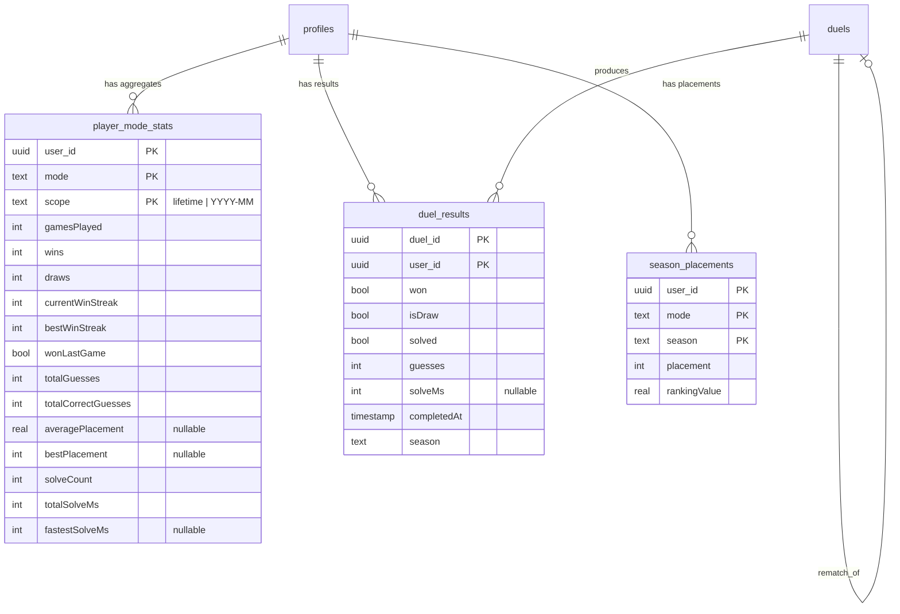

# Design Document — Retention Foundation (Phase 1)

## Approach & Review Order

This design is written **schema-first on purpose**. The database schema is the
keystone every Phase 1 feature reads from, and it's the hardest thing to change
after data lands. So Section 1 (Data Model) is the first and only thing to be
**built and reviewed** before the rest.

Build/review sequence we agreed on:

1. **Schema + migration only** (Section 1). You review it. ← _first deliverable_
2. Stats pipeline wiring (Section 2).
3. tRPC routers (Section 3).
4. Client pages + navbar (Section 4).

Sections 2–4 are included here so the schema's shape is justified by how it will
be used — but they are **not** implemented until the schema is approved.

---

## Guiding Design Decisions

A few decisions shape the whole schema. Calling them out up front:

- **D1 — Mode is a string column, not a Postgres enum.** R1.2 requires adding a
  new mode (e.g. `classic`) with no schema change. A Postgres `enum` would need
  an `ALTER TYPE` migration to add a value. We use a `text` column plus a shared
  TypeScript union (`GameMode`) in `packages/db` as the compile-time guard. One
  canonical constant list, zero migration to add a mode.

- **D2 — One unified stats model, not a table per mode.** Today there are two
  near-identical tables (`battle_royale_stats`, `race_stats`). Adding duel +
  seasonal + future modes by cloning that table would be 2 × modes × (lifetime +
  seasonal) tables. Instead: **one `player_mode_stats` table keyed by
  `(userId, mode, scope)`**, where `scope` is either `lifetime` or a season key.
  This collapses "lifetime vs seasonal" and "per mode" into rows, not tables.

- **D3 — Keep the existing tables during transition (additive migration).**
  R7.3 forbids data loss. We do NOT drop `battle_royale_stats` / `race_stats` in
  this migration. The new `player_mode_stats` is introduced alongside them; the
  server write paths are migrated to also/instead write the unified table in
  Section 2. A later, separate migration can backfill and retire the old tables
  once the new path is proven. (Section 1 only adds; it never drops.)

- **D4 — Duels need a per-match result table, not just an aggregate.** Lifetime
  aggregates can't answer "head-to-head vs Sarah" or "recent results". We add a
  thin, immutable `duel_results` fact table (one row per participant per
  completed duel) that head-to-head and duel history are computed from, and that
  the duel Stats_Pipeline also folds into `player_mode_stats`.

- **D5 — Season key is `YYYY-MM` (UTC), derived by one shared helper.** Mirrors
  the existing `utcDayKey` pattern already in `packages/db`. The season boundary
  is purely a function of time; no cron/reset job is needed for accrual (a new
  month simply writes under a new scope value, exactly like `realtime_game_usage`
  gets a fresh row per day).

- **D6 — Season archival is a snapshot, computed on demand, stored once.** The
  live current-season leaderboard is derived from `player_mode_stats`. When a
  season ends, we snapshot its final standings into `season_placements` (one row
  per user/mode/season with final rank). This satisfies "placements queryable
  forever" (R4.3–4.4) cheaply and makes "October 2026 — #47" a single indexed
  read, while the underlying aggregates are still retained (R4.5).

---

## Section 1 — Data Model (SCHEMA — review this first)

All tables are Drizzle-owned in `packages/db/src/schema.ts` and introduced via a
generated migration. New shared constants/types also live in `packages/db` so
client and server share one source of truth (R7.4).

### 1.0 Shared constants & types (added to `packages/db`)

```ts
/** The game modes that can produce stats. `text` column (D1) + this union is
 *  the guard. Adding "classic" later = add it here, NO migration. */
export const GAME_MODES = ["battle_royale", "race", "duel", "classic"] as const;
export type GameMode = (typeof GAME_MODES)[number];

/** Stats scope: lifetime, or a specific season. Stored in the same `scope`
 *  text column. "lifetime" is the one reserved non-season value. */
export const LIFETIME_SCOPE = "lifetime" as const;

/** Season key = UTC calendar month "YYYY-MM". One shared helper so client reads
 *  and server writes agree on the boundary (R1.6, R4.1). Mirrors utcDayKey. */
export const seasonKey = (now: Date = new Date()): string =>
  now.toISOString().slice(0, 7); // "2026-10"

/** A stats scope value is either lifetime or a season key. */
export type StatsScope = typeof LIFETIME_SCOPE | string; // "lifetime" | "YYYY-MM"
```

### 1.1 `player_mode_stats` — unified lifetime + seasonal aggregates (NEW, D2)

The heart of the stats foundation. **One row per `(userId, mode, scope)`.** A
player who plays Battle Royale in October has (at least) two rows: one
`scope = "lifetime"` and one `scope = "2026-10"`. The seasonal row and the
lifetime row are updated in the same operation on each game finish (R1.4).

```ts
export const playerModeStats = pgTable(
  "player_mode_stats",
  {
    userId: uuid("user_id")
      .notNull()
      .references(() => profiles.id, { onDelete: "cascade" }),
    // GameMode union at the type level; plain text at the DB level (D1).
    mode: text("mode").notNull(),
    // "lifetime" or a season key "YYYY-MM" (D5). Plain text (D1-style).
    scope: text("scope").notNull(),

    // --- Core outcome counters (apply to every mode) ---
    gamesPlayed: integer("games_played").notNull().default(0),
    wins: integer("wins").notNull().default(0),
    draws: integer("draws").notNull().default(0),
    // losses are derived: gamesPlayed - wins - draws (not stored).

    // --- Streaks (consecutive wins, ending at most recent game) ---
    currentWinStreak: integer("current_win_streak").notNull().default(0),
    bestWinStreak: integer("best_win_streak").notNull().default(0),
    wonLastGame: boolean("won_last_game").notNull().default(false),

    // --- Guess economy (all modes record guesses) ---
    totalGuesses: integer("total_guesses").notNull().default(0),
    totalCorrectGuesses: integer("total_correct_guesses").notNull().default(0),

    // --- Placement (multiplayer modes: BR/Race). Null-able for modes with no
    //     placement concept (e.g. duel/classic use win/solve, not placement). ---
    // Running average finishing placement (1 = won). Null until first placed game.
    averagePlacement: real("average_placement"),
    bestPlacement: integer("best_placement"),

    // --- Solve timing (modes that time a solve: duel, future classic). Stored
    //     in milliseconds. Null for modes that don't time an individual solve. ---
    solveCount: integer("solve_count").notNull().default(0), // # timed solves
    totalSolveMs: integer("total_solve_ms").notNull().default(0), // sum, for avg
    fastestSolveMs: integer("fastest_solve_ms"), // min, null until first solve

    lastPlayedAt: timestamp("last_played_at", { withTimezone: true }),
    createdAt: timestamp("created_at", { withTimezone: true })
      .defaultNow()
      .notNull(),
    updatedAt: timestamp("updated_at", { withTimezone: true })
      .defaultNow()
      .notNull(),
  },
  (t) => [
    // One aggregate per player, per mode, per scope.
    primaryKey({ columns: [t.userId, t.mode, t.scope] }),
    // Leaderboard reads: "all rows for this mode+scope, ranked". The PK is
    // (user,mode,scope) so this secondary index serves the leaderboard scan.
    index("pms_mode_scope_idx").on(t.mode, t.scope),
  ],
);
```

Design notes on `player_mode_stats`:

- **Derived-on-read rates** (win rate, losses, avg guesses, avg solve) stay
  derived, matching the current `battle_royale_stats` philosophy. We store the
  running sums/counts needed to derive them cheaply.
- **Nullable mode-specific columns** keep one table honest across modes:
  placement is null for duel/classic; solve timing is null for BR/Race. A column
  being null = "this mode doesn't track this", not "zero".
- **Running average placement** reuses the exact SQL recurrence already proven in
  `battle-royale/stats.ts` (`(avg*n + x)/(n+1)`), computed from pre-increment
  values in the `onConflictDoUpdate` SET.
- **Streak SQL** reuses the proven `case when ... then +1 else 0` /
  `greatest(...)` pattern from the current stats upsert.

### 1.2 `duel_results` — per-participant duel fact table (NEW, D4)

Immutable facts, one row per participant per completed duel. This is what
head-to-head (R6.2–6.3) and duel history (R6.4) read, and what the duel
Stats_Pipeline folds into `player_mode_stats`. It never stores the secret word.

```ts
export const duelResults = pgTable(
  "duel_results",
  {
    duelId: uuid("duel_id")
      .notNull()
      .references(() => duels.id, { onDelete: "cascade" }),
    userId: uuid("user_id")
      .notNull()
      .references(() => profiles.id, { onDelete: "cascade" }),
    // Did THIS participant win the duel (userId === duels.winner)? A draw has
    // won=false for everyone and isDraw=true.
    won: boolean("won").notNull(),
    isDraw: boolean("is_draw").notNull().default(false),
    // Did they solve the word at all (independent of winning)?
    solved: boolean("solved").notNull(),
    guesses: integer("guesses").notNull(),
    // Solve duration in ms (endTime - startTime). Null if they never finished
    // a timed attempt (declined/never-played participants get no result row).
    solveMs: integer("solve_ms"),
    // Denormalized completion time = the duel's completion moment. Lets history
    // and H2H sort by date and derive the season without joining `duels`.
    completedAt: timestamp("completed_at", { withTimezone: true }).notNull(),
    // Season key at completion ("YYYY-MM"), denormalized for seasonal H2H/filtering.
    season: text("season").notNull(),
  },
  (t) => [
    primaryKey({ columns: [t.duelId, t.userId] }),
    // Duel history for a user, newest first.
    index("duel_results_user_completed_idx").on(t.userId, t.completedAt),
  ],
);
```

Design notes:

- Only **completed** duels produce `duel_results`, and only for participants who
  actually have a `duel_participants` row with an `endTime` (R6.1, R6.5). An
  invitee who never played gets no result row — they're not part of anyone's H2H.
- Head-to-head between A and B is computed by finding duel IDs where both A and B
  have result rows (self-join on `duelId`), then aggregating A's `won` vs B's
  `won` and `isDraw`. Two-player duels are the common case; the model also works
  for multi-player duels (H2H counts a game between A and B whenever both
  participated, regardless of other participants).
- `completedAt` + `season` are denormalized so history, H2H, and the seasonal
  duel leaderboard never need to join `duels`.
- `onDelete: cascade` from `duels`/`profiles` keeps referential integrity, but
  **friendship deletion does not touch this table** (R6.7) — H2H survives an
  unfriend.

### 1.3 `duels` change — rematch linkage (ALTER, D-rematch, R5.5)

One nullable self-reference records that a duel was created as a rematch of
another, so a rivalry chain is traceable.

```ts
export const duels = pgTable("duels", {
  // ... all existing columns unchanged ...
  // NEW: the duel this one was spawned from via "Rematch", null for originals.
  rematchOfDuelId: uuid("rematch_of_duel_id").references(
    (): AnyPgColumn => duels.id,
    { onDelete: "set null" },
  ),
});
```

Design notes:

- `onDelete: set null` so deleting an old duel doesn't cascade-destroy the chain;
  the newer duel simply loses its backward link.
- The self-reference needs Drizzle's `AnyPgColumn` type on the callback (standard
  Drizzle pattern for self-FKs).
- No change to the existing duel lifecycle; this column is written only by the
  new `rematchDuel` mutation (Section 3).

### 1.4 `season_placements` — archived final standings (NEW, D6, R4.3–4.4)

One row per `(userId, mode, season)` capturing a player's **final** rank in a
completed season. Written once when a season is archived. The underlying
`player_mode_stats` seasonal rows are retained regardless (R4.5), so this is a
fast-read snapshot, not the only copy of the truth.

```ts
export const seasonPlacements = pgTable(
  "season_placements",
  {
    userId: uuid("user_id")
      .notNull()
      .references(() => profiles.id, { onDelete: "cascade" }),
    mode: text("mode").notNull(),
    season: text("season").notNull(), // "YYYY-MM"
    placement: integer("placement").notNull(), // 1 = best
    // Snapshot of the headline metric at archival, so the archive renders
    // without recomputing (e.g. wins for the ranking metric).
    gamesPlayed: integer("games_played").notNull(),
    wins: integer("wins").notNull(),
    rankingValue: real("ranking_value").notNull(), // the metric it was ranked by
    archivedAt: timestamp("archived_at", { withTimezone: true })
      .defaultNow()
      .notNull(),
  },
  (t) => [
    primaryKey({ columns: [t.userId, t.mode, t.season] }),
    // "my placement history across seasons" and "this season's archived board".
    index("season_placements_user_idx").on(t.userId, t.mode, t.season),
    index("season_placements_board_idx").on(t.mode, t.season, t.placement),
  ],
);
```

Design notes:

- Archival is **idempotent** and reproducible from `player_mode_stats` (R4.5):
  re-running the archive for a season recomputes the same ranks.
- Archival trigger: a scheduled job (or lazy on first read of a past season)
  computes ranks for the just-ended season and upserts here. The mechanism is a
  Section-2/3 concern; the schema only needs to store the result.
- "October 2026 — #47" is a single indexed read on `season_placements_user_idx`.

### 1.5 Type exports (added alongside existing `$inferSelect`/`$inferInsert`)

```ts
export type PlayerModeStats = typeof playerModeStats.$inferSelect;
export type NewPlayerModeStats = typeof playerModeStats.$inferInsert;
export type DuelResult = typeof duelResults.$inferSelect;
export type NewDuelResult = typeof duelResults.$inferInsert;
export type SeasonPlacement = typeof seasonPlacements.$inferSelect;
export type NewSeasonPlacement = typeof seasonPlacements.$inferInsert;
```

### 1.6 Supabase concerns (separate SQL, per R7.2)

Tracked under `supabase/migrations`, applied after the Drizzle tables exist:

- **RLS**: `player_mode_stats`, `season_placements`, and `duel_results` are read
  server-side via the privileged tRPC connection. If the client ever reads any
  of them directly (e.g. a realtime leaderboard), add explicit SELECT policies
  then. Default stance for Phase 1: **no client-facing SELECT policy** (reads go
  through tRPC), mirroring how `duel_secrets` is locked down.
- **Realtime**: none of these tables need to be in the `supabase_realtime`
  publication for Phase 1 (stats/leaderboard are query-on-load, not live-pushed).
  The duel realtime channel on `duel_participants` is unchanged.

### 1.7 What this migration does NOT do (safety, R7.3 / D3)

- Does **not** drop or rename `battle_royale_stats` or `race_stats`.
- Does **not** alter any existing column on `profiles`, `friendships`,
  `duel_participants`, or `duel_secrets`.
- The only ALTER is the additive, nullable `rematch_of_duel_id` on `duels`.

Everything else is new tables + two new indexes. Fully additive and reversible.

### 1.8 Migration ERD (new/changed only)



---

## Section 2 — Stats Pipeline (built after schema approval)

### 2.1 Unified upsert helper (`packages/db` or a shared stats module)

A single `upsertModeStats(tx, { userId, mode, scope, outcome }, now)` writes one
`player_mode_stats` row. The game-finish path calls it **twice** per player per
game — once with `scope = "lifetime"`, once with `scope = seasonKey(now)` —
inside the same transaction (R1.4), so both move together or not at all.

The SET clause reuses the proven recurrences from `battle-royale/stats.ts`:

- `gamesPlayed +1`, `wins + winInc`, `draws + drawInc`
- `averagePlacement = (avg*n + placement)/(n+1)` — only when the mode supplies a
  placement; otherwise left null/untouched.
- `currentWinStreak = case when won then +1 else 0`, `bestWinStreak = greatest(...)`
- solve timing: `solveCount +1`, `totalSolveMs + ms`,
  `fastestSolveMs = least(coalesce(fastest, ms), ms)` — only when timed.

### 2.2 Migrating existing writers

- `apps/server` Battle Royale (`battle-royale/stats.ts`) and Race (`race/stats.ts`)
  switch from writing `battle_royale_stats`/`race_stats` to calling
  `upsertModeStats` with `mode: "battle_royale" | "race"`. During transition we
  can dual-write (old + new) behind a flag, then retire the old tables in a
  later migration (D3). Idempotency guard (`player.statsPersisted`) is unchanged.

### 2.3 New duel writer

When a duel transitions to `completed = true` (in `duels` router: the
`handleDuelGuess`/`declineDuel`/`forfeitDuel` completion branch), the server:

1. Inserts `duel_results` rows for each participant with an `endTime`
   (`won = userId === winner`, `isDraw`, `solved = success`, `guesses`,
   `solveMs = endTime - startTime`, `completedAt`, `season`). Idempotent via the
   `(duelId, userId)` PK (`onConflictDoNothing`).
2. Folds each into `player_mode_stats` with `mode: "duel"` (lifetime + season).

This is additive to the existing duel completion logic and wrapped in the
existing transaction that sets `completed = true`.

### 2.4 Season archival

A `seasonKey`-driven routine computes ranks for a just-ended season from
`player_mode_stats` (WHERE `scope = season`) and upserts `season_placements`.
Invoked by a scheduled task or lazily when a past season is first requested
(R4.6). Idempotent and reproducible (R4.5).

---

## Section 3 — tRPC Routers (built after schema approval)

New routers registered in `apps/client/src/server/api/root.ts`, following the
existing `guestProtectedProcedure` pattern.

### 3.1 `stats` router
- `me` → the current user's `player_mode_stats` rows for a given scope
  (lifetime or current season), shaped per mode with derived rates.
- `myPlacements` → `season_placements` for the current user (placement history).

### 3.2 `leaderboard` router
- `board({ mode, season? })` → ranked page from `player_mode_stats`
  (current season / lifetime) or `season_placements` (archived), with the
  caller's own rank surfaced (R3.4). Ranking metric + tiebreakers per mode:
  - **duel**: wins DESC, then win rate DESC, then avg solve ASC.
  - **battle_royale / race**: wins DESC, then avg placement ASC, then games DESC.
  - Tiebreakers are deterministic (final tiebreak on `userId`).

### 3.3 `duels` router additions
- `rematchDuel(sourceDuelId)` → validates completion + participation, re-runs the
  `sendDuel` eligibility checks (friends still valid R5.7, active-duel cap R5.4,
  invitee cap), creates a new duel with `rematchOfDuelId` set and the same
  participants + a fresh secret word.
- `headToHead(opponentId)` → aggregates `duel_results` over shared duel IDs:
  totals, each side's wins, draws, rivalry streak, recent results (R6.2–6.3).
- `history()` → the current user's `duel_results` joined to opponents, newest
  first (R6.4).

---

## Section 4 — Client Pages & Navbar (built after schema approval)

- **`/stats`** (`apps/client/src/pages/stats.tsx`) — per-mode cards, Lifetime vs
  Season toggle, current-season placement, premium-gated advanced rows (R2).
  Guarded by `useRequireAuth` like `profile.tsx`.
- **`/leaderboard`** (`apps/client/src/pages/leaderboard.tsx`) — mode + season
  selectors, ranked table, caller row pinned, free vs premium columns (R3).
- **Duel result view** — add a **Rematch** button and a **head-to-head** panel
  ("You vs. Sarah — 23 games, 11–10, 2 draws, Sarah won the last 2") to the
  existing duel result component, making "see record → rematch" one flow (R6.6).
- **Navbar** — add `Stats` and `Leaderboard` links (desktop + mobile menus),
  following the existing active-route styling. Stats is registered-only like
  Friends/Profile; Leaderboard is visible to all.

---

## Testing Strategy (per section, built with each section)

- **Schema**: a generated migration that applies cleanly on a fresh DB and on a
  DB already holding `battle_royale_stats`/`race_stats` data (additive check).
- **Pipeline**: property tests mirroring the existing `stats-eligibility` /
  `persisted-stats` tests — eligibility is `isRealPlayer` alone; the lifetime
  and seasonal rows written for one game are consistent; duel completion writes
  exactly one `duel_results` row per finisher (idempotent).
- **Routers**: unit tests for ranking determinism + tiebreakers, H2H aggregation
  (incl. draws and multi-player duels), and rematch eligibility rejection paths.
- **Pages**: render/loading/empty states; premium gating doesn't break free
  layout.

---

## Open Questions (flag before/with schema review)

1. **Dual-write vs cutover** for BR/Race stats (D3): dual-write both tables for a
   transition window, or cut straight over to `player_mode_stats` and backfill
   the old data in the same migration? (Recommended: dual-write briefly, retire
   later — lowest risk.)
2. **Qualifying threshold** for leaderboard inclusion (R3.6) — minimum games in a
   season/mode to appear (e.g. ≥1 vs ≥5)? Affects early-season sparsity.
3. **Duel ranking metric** — is "wins, then win rate, then avg solve" the right
   competitive signal, or should solo solve speed matter more?
4. **Classic timing** — confirm Classic is future-only (no write path now); the
   schema already accepts it with no change (D1).
