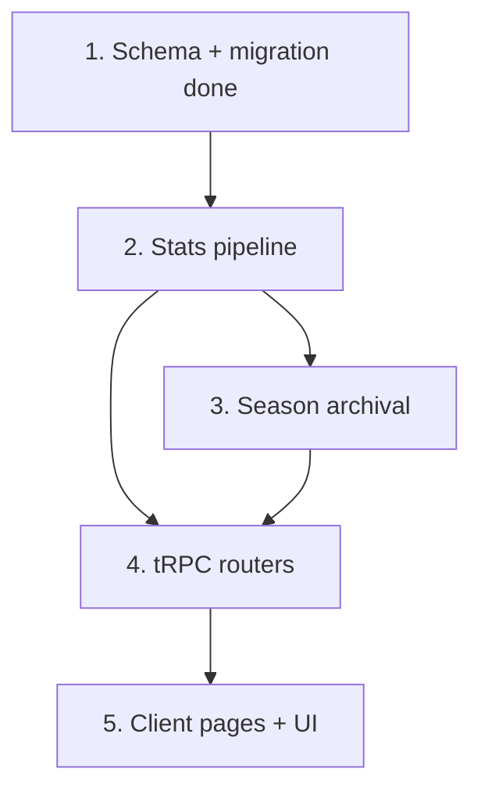

# Implementation Plan — Retention Foundation (Phase 1)

Tasks map to `requirements.md` (R#) and `design.md` (sections / decisions D#).

## Overview

This plan turns the approved spec into incremental, test-backed coding steps.
The database schema (design Section 1) is already built, migrated, and verified,
so Task 1 is complete. The remaining work is three layers that stack:

1. **Stats pipeline (Task 2)** — the write path: a unified `upsertModeStats`
   plus the Battle Royale/Race dual-write and the new duel-completion writer.
   Everything downstream reads what this writes.
2. **Season archival (Task 3)** — the routine that snapshots a finished season's
   standings into `season_placements`.
3. **Routers + pages (Tasks 4-5)** — the tRPC read/rematch surface and the
   `/stats` + `/leaderboard` pages and duel rematch/head-to-head UI.

Tasks are ordered so each builds only on completed work. Scored modes are
`battle_royale` and `race`; `duel` is excluded from points. Points are
seasonal-only; lifetime stats stay plain counters/averages.

> Convention: `[x]` done, `[ ]` not started. "Verify" means type-check/build the
> affected package(s) and run the relevant tests before marking a task done
> (`pnpm --filter db check-types`, server `pnpm build` + `pnpm test`, client
> `pnpm typecheck`).

## Task Dependency Graph



Within each parent task, subtasks run top-to-bottom. The tests-first subtask
(2.1) precedes the implementation it covers.

The graph above is the human-readable view; the machine-readable execution
waves (each wave may run in parallel once the previous wave completes) are:

```json
{
  "waves": [
    { "wave": 1, "tasks": ["1"], "dependsOn": [] },
    { "wave": 2, "tasks": ["2.1"], "dependsOn": ["1"] },
    { "wave": 3, "tasks": ["2.2"], "dependsOn": ["2.1"] },
    { "wave": 4, "tasks": ["2.3", "2.4"], "dependsOn": ["2.2"] },
    { "wave": 5, "tasks": ["2.5"], "dependsOn": ["2.3", "2.4"] },
    { "wave": 6, "tasks": ["3.1"], "dependsOn": ["2.5"] },
    { "wave": 7, "tasks": ["3.2"], "dependsOn": ["3.1"] },
    { "wave": 8, "tasks": ["4.1", "4.2", "4.3", "4.4"], "dependsOn": ["2.5", "3.1"] },
    { "wave": 9, "tasks": ["4.5"], "dependsOn": ["4.1", "4.2", "4.3", "4.4"] },
    { "wave": 10, "tasks": ["5.1", "5.2", "5.3", "5.4"], "dependsOn": ["4.5"] },
    { "wave": 11, "tasks": ["5.5"], "dependsOn": ["5.1", "5.2", "5.3", "5.4"] }
  ]
}
```


## Tasks

- [x] 1. Schema + migration (foundation)
  - Added shared constants/types/scoring to `packages/db/src/schema.ts`:
    `GAME_MODES`/`GameMode`, `LIFETIME_SCOPE`, `seasonKey()`, `StatsScope`,
    `SCORED_MODES`/`ScoredMode`/`isScoredMode`, `SCORING_CONFIG`, `matchPoints()`.
  - Added tables `player_mode_stats`, `duel_results`, `season_placements` and the
    nullable self-FK `duels.rematch_of_duel_id`; indexes + type exports.
  - Generated the additive migration `0008_powerful_onslaught.sql` (no drops; no
    changes to `battle_royale_stats` / `race_stats`). Reconciled the duels router
    selects to include `rematchOfDuelId`.
  - _Requirements: R1, R2A.5, R4.1, R5.5, R6.1, R7.1, R7.3, R7.4_
  - _Design: Section 1 (all), D1-D6_

- [ ] 2. Unified stats pipeline (write path)

- [~] 2.1 Add scoring + mode-stats unit tests first (TDD)
  - In `packages/db` (or a shared test file), add property/unit tests for
    `matchPoints`: monotonic in better placement, win bonus iff placement 1,
    combat capped at `combatPointsCap`, result always >= 0, pure (same inputs ->
    same output). Mirror the style of the existing `stats-eligibility` tests.
  - _Requirements: R2A.1-R2A.4, R2A.9_
  - _Design: Section 1.0 (matchPoints), Testing Strategy (Scoring)_

- [~] 2.2 Implement the shared `upsertModeStats` helper
  - Create a single upsert that writes one `player_mode_stats` row for a given
    `(userId, mode, scope, outcome)`, reusing the proven SQL recurrences from
    `apps/server/src/games/battle-royale/stats.ts` (running avg placement, streak
    `case when`/`greatest`, `least(coalesce(...))` for fastest solve).
  - Points: on seasonal scored rows only, `seasonPoints += pts` and
    `bestMatchPoints = greatest(bestMatchPoints, pts)`; never on lifetime/duel.
  - Guard eligibility with the existing `isRealPlayer` predicate (bots excluded,
    guests included). Never throw into the caller; log and swallow.
  - _Requirements: R1.1-R1.8, R2A.6, R8.1-R8.2_
  - _Design: Section 2.1_

- [~] 2.3 Dual-write Battle Royale + Race onto `player_mode_stats`
  - In `battle-royale/stats.ts` and `race/stats.ts`, call `upsertModeStats` for
    both `scope = "lifetime"` and `scope = seasonKey(now)` in the same operation,
    computing `pts = matchPoints(placement, correctGuesses)` once per player.
  - Keep writing the existing `battle_royale_stats` / `race_stats` tables for now
    (D3 dual-write) so nothing regresses; retirement is a later migration.
  - Preserve the `statsPersisted` idempotency guard so each real player is
    counted exactly once across elimination/leave/finish paths.
  - _Requirements: R1.3-R1.5, R1.7, R2A.1-R2A.6_
  - _Design: Section 2.1, 2.2, D3_

- [~] 2.4 Add the duel completion writer
  - Where a duel transitions to `completed = true` in
    `apps/client/src/server/api/routers/duels.ts` (the completion branch shared
    by `handleDuelGuess` / `declineDuel` / `forfeitDuel`), within the existing
    transaction: insert one `duel_results` row per participant that has an
    `endTime` (`won`, `isDraw`, `solved`, `guesses`, `solveMs`, `completedAt`,
    `season`), idempotent via `onConflictDoNothing` on `(duelId, userId)`.
  - Fold each duel finisher into `player_mode_stats` with `mode = "duel"`
    (lifetime + season). Duel accrues NO points (not a scored mode).
  - _Requirements: R1.4-R1.5, R2A.8, R6.1, R6.5, R6.7_
  - _Design: Section 2.3, D4_

- [~] 2.5 Pipeline tests
  - Tests mirroring `persisted-stats`: one game writes a consistent lifetime +
    seasonal row; points land only on the seasonal scored row (lifetime + duel
    rows keep points 0); duel completion writes exactly one `duel_results` row
    per finisher and is idempotent on replay.
  - Verify server build + full server test suite still pass.
  - _Requirements: R1.5, R2A.6, R6.1_
  - _Design: Testing Strategy (Pipeline)_

- [ ] 3. Season archival routine

- [~] 3.1 Implement season ranking + archival
  - A `seasonKey`-driven routine that, for a completed season, reads
    `player_mode_stats WHERE scope = season AND mode in SCORED_MODES`, orders by
    the ranking metric (`seasonPoints` DESC, then `wins` DESC, `averagePlacement`
    ASC, `gamesPlayed` DESC, `userId`), and upserts `season_placements` with
    `rankingValue = seasonPoints`. Idempotent and reproducible from aggregates.
  - Expose it so it can run on a schedule or lazily on first read of a past
    season (mechanism-agnostic; the function is the deliverable).
  - _Requirements: R4.3, R4.5, R4.6, R4.7_
  - _Design: Section 2.4, D6_

- [~] 3.2 Archival tests
  - Re-running archival for a season yields identical placements (idempotent);
    archival never mutates `player_mode_stats`; ties broken deterministically.
  - _Requirements: R4.5_
  - _Design: Testing Strategy_

- [ ] 4. tRPC routers (read + rematch)

- [~] 4.1 `stats` router
  - `me({ scope })` -> current user's `player_mode_stats` rows shaped per mode
    with derived rates (win rate, losses, avg guesses, avg solve); `scope` =
    lifetime or current season. `myPlacements()` -> `season_placements` for the
    user (placement history, newest first). Register in `root.ts`.
  - Guest/premium handling consistent with existing routers
    (`guestProtectedProcedure`); advanced/premium stat fields gated per R2.7.
  - _Requirements: R2.2-R2.5, R2.7, R2.8, R8.1_
  - _Design: Section 3.1_

- [~] 4.2 `leaderboard` router
  - `board({ mode, season? })` -> ranked page from `player_mode_stats` (current
    season) or `season_placements` (archived), scored modes only, with the
    caller's own rank surfaced even when outside the visible page. Qualifying
    filter (>= 1 game by default; threshold is a constant). Deterministic
    tiebreakers. Register in `root.ts`.
  - _Requirements: R3.2-R3.7, R2A.8, R8.3_
  - _Design: Section 3.2_

- [~] 4.3 `duels.rematchDuel` mutation
  - Validate the source duel is completed and the caller participated; re-run the
    `sendDuel` eligibility checks (friends still valid, active-duel cap, invitee
    cap per tier) and reject with clear tier-aware messages on failure; create a
    new duel with `rematchOfDuelId` set, the same participants, and a fresh
    secret word, atomically (same pattern as `sendDuel`).
  - _Requirements: R5.1-R5.7_
  - _Design: Section 3.3, D-rematch_

- [~] 4.4 `duels.headToHead` + `duels.history`
  - `headToHead(opponentId)` -> aggregate `duel_results` over duel IDs where both
    users have result rows: totals, each side's wins, draws, rivalry streak,
    recent results (newest first). `history()` -> caller's `duel_results` joined
    to opponents, newest first. Only duels the caller participated in (R6.5).
  - _Requirements: R6.2-R6.6_
  - _Design: Section 3.3, D4_

- [~] 4.5 Router tests
  - Ranking determinism + tiebreakers; H2H aggregation incl. draws and
    multi-player duels; rematch eligibility rejection paths. Verify client
    typecheck passes with the new routers registered.
  - _Requirements: R3.2, R5.4, R6.2-R6.3_
  - _Design: Testing Strategy (Routers)_

- [ ] 5. Client pages + UI

- [~] 5.1 `/stats` page
  - `apps/client/src/pages/stats.tsx`: per-mode cards (games/wins/losses/draws/
    win rate/current+best streak; avg guesses, avg/fastest solve where present),
    Lifetime vs current-Season toggle, current-season placement per scored mode,
    loading + empty states, premium-gated advanced rows. Guard with
    `useRequireAuth` like `profile.tsx`.
  - _Requirements: R2.1-R2.8_
  - _Design: Section 4_

- [~] 5.2 `/leaderboard` page
  - `apps/client/src/pages/leaderboard.tsx`: mode + season selectors, ranked
    table (placement, name, headline metrics incl. season points), caller row
    pinned, free-visible core with premium-gated expanded columns. Loading +
    empty states.
  - _Requirements: R3.1, R3.3-R3.7_
  - _Design: Section 4_

- [~] 5.3 Duel result view: Rematch + head-to-head
  - Add a "Rematch" action and a head-to-head panel ("You vs. Sarah - 23 games,
    11-10, 2 draws, Sarah won the last 2") to the existing duel result component,
    wired to `rematchDuel` and `headToHead`, so "see record -> rematch" is one
    flow. Surface a new rematch like any new duel in the active list.
  - _Requirements: R5.1, R5.6, R6.6_
  - _Design: Section 4_

- [~] 5.4 Navbar links
  - Add `Stats` (registered-only, like Friends/Profile) and `Leaderboard`
    (visible to all) links to both desktop and mobile menus in
    `apps/client/src/components/navigation/navbar.tsx`, matching the existing
    active-route styling.
  - _Requirements: R2.1, R3.1_
  - _Design: Section 4_

- [~] 5.5 Page/UI tests + final verification
  - Render/loading/empty-state checks; premium gating doesn't break the free
    layout. Full verification: `db` check-types, server build + tests, client
    typecheck + relevant tests all green.
  - _Requirements: R2.6, R3.4_
  - _Design: Testing Strategy (Pages)_

## Notes

- **Dual-write, then retire.** Task 2.3 keeps the existing
  `battle_royale_stats` / `race_stats` writes alongside the new unified writes
  (D3). Retiring the old tables after dual-write proves out is a separate
  backfill migration, out of scope here.
- **Supabase RLS/realtime SQL** for the new tables is not needed while reads go
  through tRPC (design Section 1.6); add explicit policies only if a table is
  ever read directly from the client.
- **Out of scope for this plan (later phases):** ranked/MMR, additional and
  rotating game modes, daily challenge, achievements, `/road-map` +
  `/changelog` pages, duel competitive scoring, and the X account.
- **Points source is swappable.** Combat input is `correctGuesses` today; a
  future real eliminations count drops into `matchPoints`'s combat argument with
  no schema or leaderboard change (R2A.4).
