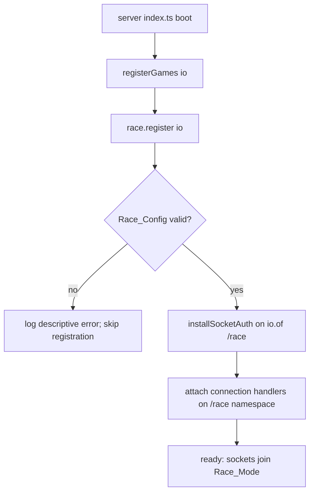
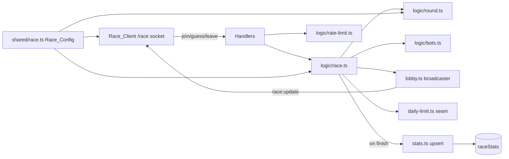
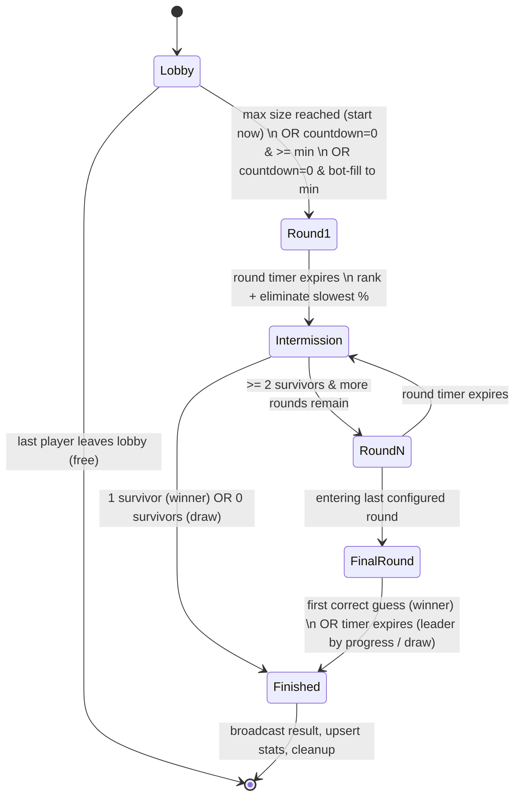

# Design Document: Round-Based Elimination Race

## Overview

Round-Based Elimination Race (Race_Mode) is a third realtime game mode for Final Word that runs on the existing Hetzner realtime server (`apps/server`) as a self-contained `GameModule`, alongside Battle Royale and Duels. It reuses the established server conventions: a `GameModule` registered through `games/registry.ts`, in-memory room state owned by the module, Socket.IO event handlers, Supabase-token socket auth, coalesced state broadcasts, bot-fill, and an upsert-on-finish aggregate stats table parallel to `battleRoyaleStats`.

A Match is a sequence of timed Rounds. Each Round assigns every Survivor a word of a configured length; the Survivor races to correctly guess a configured number of words (the Qualifying_Count). When the Round timer expires, the server ranks Survivors and eliminates the slowest configured percentage. Rounds get progressively harder until a Final_Round, where the first correct guess wins. A client-side anti-spam penalty debounces keypresses when a Player guesses faster than a configured threshold, backed by server-side rate enforcement so a modified client cannot bypass it.

Every tunable parameter — round count, per-round timer, word length, words-per-round, elimination percentage, lobby-size bounds, and penalty thresholds — comes from a single `Race_Config` object defined in a shared schema (`packages/shared`), validated at startup. If validation fails, the module refuses to register.

### Design Goals

- **Mirror Battle Royale's structure** so the module is familiar to maintain: `index.ts`, `handlers.ts`, `state.ts`, `lobby.ts`, `stats.ts`, and a `logic/` folder.
- **Isolate Race_Mode fully** from Battle Royale and Duels state and events by registering on a dedicated Socket.IO namespace (`/race`).
- **Config-driven behavior** with zero gameplay constants hardcoded in the game loop.
- **A single daily-limit seam** that is dormant during beta and requires no Match/Round logic change to activate when Feature 1 ships.

### Key Design Decisions

| Decision | Choice | Rationale |
| --- | --- | --- |
| Event/state isolation | Register Race on the `io.of("/race")` namespace | Battle Royale attaches to the default namespace with generic event names (`join`, `guess`, `lobby:update`). A namespace gives clean event/state separation (Req 1.3) while reusing the same auth middleware. |
| Auth | Reuse `installSocketAuth`, extended to run on the `/race` namespace | Req 1.4 requires rejecting unauthenticated sockets before any handler runs; the existing middleware already populates `socket.data.userId`/`name`. |
| Round state machine | Explicit `phase` field (`lobby` → `round` → `intermission` → `finished`) | Makes transitions, timer ownership, and guard conditions unambiguous and testable. |
| Config location | `packages/shared/src/race.ts` with a Zod schema + validated default | Req 2.5 requires client and server to reference the same definitions; shared package is already the config home (`battle-royale.ts`). |
| Stats | New `raceStats` Drizzle table, SQL-increment upsert-on-finish | Req 8 mirrors `battleRoyaleStats` exactly, including concurrent-safe increments. |
| Anti-spam | Client debounce + server token-bucket rate gate keyed per player | Req 7.4 requires server enforcement so the client penalty cannot be bypassed. |

## Architecture

### Module layout

The module lives at `apps/server/src/games/race/`, mirroring `battle-royale/`:

```
apps/server/src/games/race/
  index.ts              # GameModule export { id: "round-based-elimination-race", register }
  handlers.ts           # namespace connection + join/guess/leave/disconnect handlers
  state.ts              # in-memory maps (matches, serverOnlyData, botData) + config load
  lobby.ts              # emit/schedule coalesced state broadcasts
  stats.ts              # raceStats upsert-on-finish + leaver-as-loss
  daily-limit.ts        # the Feature-1 seam (increment + canStart)
  logic/
    race.ts             # match lifecycle: create lobby, start match, round begin/end, elimination, finish, cleanup
    round.ts            # word assignment, guess grading, qualification, ranking + elimination selection (pure)
    rate-limit.ts       # server-side per-player guess rate gate (pure token check)
    bots.ts             # bot fill + bot guess simulation ticker
    words.ts            # per-length word lists (4/5/6) + getRandomWord(length)
```

### Registration flow



`registry.ts` gains `race` in the `gameModules` array. `race.register(io)` reads and validates `Race_Config`; on failure it logs and returns without attaching handlers (Req 2.7, 1.1, 1.2). The current `installSocketAuth(io)` middleware is refactored into an installable that can be applied to a namespace, then applied to `io.of("/race")` so Race sockets are authenticated before any handler runs (Req 1.4). Battle Royale is unchanged.

### Runtime relationships



### Round / elimination state machine

A Match progresses through explicit phases. One authoritative `phase` field on the room drives every guard (a guess is only graded in `round`, elimination only runs on round-timer expiry, etc.).



Phase semantics:

- **Lobby**: accepting Players; start conditions per Req 3.3–3.5. Excluded from new joiners once started (Req 3.7).
- **Round (non-final)**: each Survivor has an assigned word + per-round completed-word count; a Round timer runs. On expiry the server ranks and eliminates (Req 5).
- **Intermission**: a brief transition window during which the client shows advanced/eliminated players (Req 10.3). The server evaluates continuation: another round, a single-survivor winner, or a draw (Req 5.6–5.8).
- **Final_Round**: first correct guess wins immediately (Req 6.2); timer expiry resolves by progress or draw (Req 6.4, 6.5).
- **Finished**: result broadcast (Req 6.6, 5.9), stats upsert (Req 8), timers cleared, room deleted (Req 9.4).

### Round selection and progression

Rounds are indexed `0..N-1` from `Race_Config.rounds`. `currentRoundIndex` selects the active `RoundConfig` (timer, word length, qualifying count, elimination percentage). The Final_Round is `rounds[N-1]`, whose `qualifyingCount` is required to equal 1 (Req 2.8) and enforced by schema `.refine`. "Progressively harder" (longer words, fewer words) is expressed purely through config values and is not encoded in logic.

## Components and Interfaces

### Shared config: `packages/shared/src/race.ts`

Defines the `Race_Config` schema (Zod) plus a validated default constant. Both server and client import from `shared/race.js` (Req 2.5). Validation covers: at least one round, final round `qualifyingCount === 1`, `minLobbySize <= maxLobbySize`, positive timers/lengths, and elimination percentages in `(0, 1]`.

```ts
import { z } from "zod";

export const roundConfigSchema = z.object({
  timerMs: z.number().int().positive(),        // Round timer duration (Req 2.2)
  wordLength: z.number().int().min(3).max(8),   // word length for this round (Req 2.2)
  qualifyingCount: z.number().int().positive(), // words to be safe (Req 2.2)
  eliminationPct: z.number().min(0).max(1),     // proportion eliminated (Req 2.2)
});

export const raceConfigSchema = z
  .object({
    rounds: z.array(roundConfigSchema).min(1),                 // Req 2.1
    minLobbySize: z.number().int().positive(),                 // Req 2.3
    maxLobbySize: z.number().int().positive(),                 // Req 2.3
    lobbyCountdownMs: z.number().int().positive(),
    penaltyThresholdMs: z.number().int().positive(),           // Req 2.4
    debounceAmountMs: z.number().int().positive(),             // Req 2.4
    updateWindowMs: z.number().int().positive().default(250),  // broadcast coalescing (Req 4.7)
  })
  .refine((c) => c.minLobbySize <= c.maxLobbySize, {
    message: "minLobbySize must be <= maxLobbySize",
  })
  .refine((c) => c.rounds.at(-1)?.qualifyingCount === 1, {
    message: "final round qualifyingCount must equal 1", // Req 2.8
  });

export type RoundConfig = z.infer<typeof roundConfigSchema>;
export type RaceConfig = z.infer<typeof raceConfigSchema>;

// Rounding rule for eliminations: ceil, guaranteeing >= 1 elimination when
// more than one survivor remains (resolves Open Question 1).
export const eliminationCount = (survivors: number, pct: number): number =>
  survivors <= 1 ? 0 : Math.min(survivors - 1, Math.max(1, Math.ceil(survivors * pct)));

export const RACE_CONFIG: RaceConfig = raceConfigSchema.parse({
  rounds: [
    { timerMs: 90_000, wordLength: 4, qualifyingCount: 3, eliminationPct: 0.3 },
    { timerMs: 75_000, wordLength: 5, qualifyingCount: 2, eliminationPct: 0.4 },
    { timerMs: 60_000, wordLength: 6, qualifyingCount: 1, eliminationPct: 0 },
  ],
  minLobbySize: 4,
  maxLobbySize: 32,
  lobbyCountdownMs: 30_000,
  penaltyThresholdMs: 300,
  debounceAmountMs: 600,
  updateWindowMs: 250,
});
```

The default values above address Open Questions 1, 2, and 4 with the requirements' proposed defaults; they are tunable without code change.

### Server module surface

`logic/race.ts` (match lifecycle, impure — owns timers, broadcasts, cleanup):

```ts
getOrCreateLobby(matches, config): RaceMatch
startMatch(match, nsp, config, deps): void          // sets phase=round, begins round 0
beginRound(match, nsp, config, roundIndex): void     // assign words, start round timer
endRound(match, nsp, config): void                   // rank, eliminate, transition
finishMatch(match, nsp, winnerId | undefined): void  // set phase=finished, broadcast, stats, cleanup
cleanupMatch(matchId, matches, serverOnlyData, botData): void
findMatchForUser(matches, userId): RaceMatch | undefined
```

`logic/round.ts` (pure grading/ranking helpers — the heavily property-tested core):

```ts
assignWord(length): string
gradeGuess(guess, target): { isMatch: boolean; perLetter: LetterFeedback[] }  // Req 4.3
isCorrectLength(guess, length): boolean                                        // Req 4.6
rankSurvivors(survivors: RoundPlayer[]): RoundPlayer[]                          // Req 5.1-5.3
selectEliminated(ranked: RoundPlayer[], pct, config): string[]                 // Req 5.4
resolveFinalRound(survivors: RoundPlayer[]): { winnerId?: string; ranking: string[] } // Req 6.4-6.5
```

`logic/rate-limit.ts` (pure): `acceptGuess(lastAcceptedAt, now, thresholdMs): boolean` — server-side gate enforcing that accepted guesses do not exceed the Penalty_Threshold rate (Req 7.4).

### Daily-limit seam: `daily-limit.ts`

A single module isolates all Daily_Game_Counter interaction (Req 11.4). During beta the implementation is a no-op that always permits and does not throw. When Feature 1 ships, only this file changes.

```ts
// Returns true if the player may start a match. Dormant beta impl: always true.
export const canStartMatch = async (userId: string): Promise<boolean> => true; // Req 11.2

// Record a match start against the player's daily usage. Dormant beta impl: no-op.
export const recordMatchStart = async (userId: string): Promise<void> => {}; // Req 11.1
```

`startMatch` calls `canStartMatch` per real player and `recordMatchStart` on start. Because the beta impl always permits, the mode is unlimited (Req 11.2). When enforcement exists, a player at the limit is prevented from starting (Req 11.3) without touching Match/Round logic (Req 11.4).

### Socket.IO event contracts (namespace `/race`)

Client → Server:

| Event | Payload | Behavior |
| --- | --- | --- |
| `join` | none | Place player into an open lobby or reconnect to their in-progress match (Req 3.1–3.2, 9.2, 9.5). |
| `guess` | `{ word: string }` | Grade against the player's assigned word if length matches; enforce server rate gate (Req 4.3, 4.6, 7.4, 4.8). |
| `leave` | `ack?` | Explicit leave: forfeit if in-progress (Req 9.3, 8.6); free if in lobby (Req 8.7). |
| `time:sync` | `(clientSentAt, ack)` | Clock-skew handshake (reused from existing time-sync). |

Server → Client:

| Event | Payload | Meaning |
| --- | --- | --- |
| `join:ack` | `ClientRaceMatch` | Current match/lobby snapshot on join or reconnect (Req 9.2, 10.1). |
| `join:error` | `{ reason }` | Rejected (e.g. daily limit when active) (Req 11.3). |
| `race:update` | `ClientRaceMatch` | Coalesced lobby/round progress broadcast (Req 3.6, 4.7, 10.1–10.2). |
| `guess:ack` | `{ isMatch, perLetter, throttled? }` | Per-letter feedback; `throttled` when the server rate-gated the guess (Req 10.6, 7.4). |
| `round:transition` | `{ roundIndex, advanced[], eliminated[] }` | Round-end summary (Req 5.9, 10.3). |
| `eliminated` | `{ placement }` | This player was eliminated; final placement (Req 5.5, 10.4). |
| `match:result` | `{ winnerId?, placements[] }` | Final result (Req 6.6, 10.5). |

`ClientRaceMatch` is the JSON-serialized `RaceMatch` (players `Map` → `Record`), matching how Battle Royale serializes `Game` before emit.

## Data Models

### Shared types: `packages/types/src/race.types.ts`

```ts
export type RacePhase = "lobby" | "round" | "intermission" | "finished";

export type LetterFeedback = { index: number; letter: string; state: "correct" | "present" | "absent" };

// One player's per-round + per-match state (display-safe; assigned word is server-only).
export type RacePlayer = {
  name: string;
  isBot: boolean;
  isEliminated: boolean;
  // per-round
  completedWords: number;        // words correctly guessed this round (Req 4.4)
  qualified: boolean;            // reached qualifyingCount this round (Req 4.5)
  qualifiedAt?: number;          // timestamp qualification occurred (Req 4.5, 5.2)
  roundGuesses: number;          // guesses this round (tie-break, Req 5.3)
  // per-match aggregates (persisted)
  totalGuesses: number;
  correctGuesses: number;
  // finishing outcome
  placement?: number;            // final placement (Req 5.5)
  eliminatedAt?: number;         // time of elimination (Req 5.5)
  // latest grading feedback for the client
  lastFeedback?: LetterFeedback[];
};

export type RaceRoom = {
  matchId: string;
  phase: RacePhase;
  createdAt: number;
  lobbyDeadline: number;         // countdown-to-start (Req 3.4, 10.1)
  currentRoundIndex: number;
  roundEndsAt?: number;          // absolute round-timer expiry (Req 4.2, 10.2)
  winnerId?: string;
  isDraw: boolean;
};

export type RaceMatch = { room: RaceRoom; players: Map<string, RacePlayer> };
export type ClientRaceMatch = { room: RaceRoom; players: Record<string, RacePlayer> };

// Server-only per-player secret state (never broadcast) — the assigned word,
// and rate-gate bookkeeping. Parallels Battle Royale's PlayerServerData.
export type RacePlayerServerData = { word: string; lastAcceptedGuessAt: number };
```

`state.ts` holds `matches: Map<string, RaceMatch>`, `serverOnlyData: Map<string, { players: Record<string, RacePlayerServerData>; timers: RaceRoomTimers }>`, and bot data, exactly paralleling Battle Royale's separation of display state and server-only secrets. Real players are keyed by Supabase UUID; bots by `bot0`, `bot1`, … (same convention as Battle Royale, so the existing UUID regex distinguishes them for stats — Req 8.4).

### New Drizzle table: `raceStats` (in `packages/db/src/schema.ts`)

One aggregate row per Player, keyed by Supabase UUID, parallel to `battleRoyaleStats` (Req 8.1, 8.5):

```ts
export const raceStats = pgTable("race_stats", {
  userId: uuid("user_id").primaryKey().references(() => profiles.id, { onDelete: "cascade" }),
  gamesPlayed: integer("games_played").notNull().default(0),
  wins: integer("wins").notNull().default(0),
  draws: integer("draws").notNull().default(0),
  averagePlacement: real("average_placement").notNull().default(0),
  bestPlacement: integer("best_placement"),
  totalGuesses: integer("total_guesses").notNull().default(0),
  totalCorrectGuesses: integer("total_correct_guesses").notNull().default(0),
  currentWinStreak: integer("current_win_streak").notNull().default(0),
  bestWinStreak: integer("best_win_streak").notNull().default(0),
  wonLastGame: boolean("won_last_game").notNull().default(false),
  lastPlayedAt: timestamp("last_played_at", { withTimezone: true }),
  createdAt: timestamp("created_at", { withTimezone: true }).defaultNow().notNull(),
  updatedAt: timestamp("updated_at", { withTimezone: true }).defaultNow().notNull(),
});

export type RaceStats = typeof raceStats.$inferSelect;
export type NewRaceStats = typeof raceStats.$inferInsert;
```

A new migration is generated via `pnpm db:generate` (Drizzle owns migrations per the schema file's ownership note).

### Upsert-on-finish flow (`stats.ts`)

Mirrors `persistBattleRoyaleStats` exactly, retargeted to `raceStats`:

- `rankPlayers(match)` assigns each real player their finishing placement across the full field (bots included for ordering, excluded from persistence — Req 8.4): winner = placement 1; others by `eliminatedAt` (later elimination = better placement) then by round performance tie-break; draw → everyone placement 1, no win.
- `upsertPlayerStat` uses `onConflictDoUpdate` with SQL increments (`+`, running-average formula, `least`/`greatest`), so concurrent writes never clobber each other (Req 8.3). Fields recorded match Req 8.5.
- `persistRaceStats` is fire-and-forget from `cleanupMatch` on `phase === "finished"`; it wraps everything in try/catch and swallows errors so cleanup always completes (Req 8.8).
- `persistLeaverAsLoss(match, userId)` snapshots placement synchronously (alive-count at moment of leaving) before removal, records a loss for a real player leaving an in-progress match (Req 8.6), and no-ops for bots and lobby leavers (Req 8.7).

### Anti-spam penalty model

Two cooperating layers (Req 7):

- **Client debounce (`Race_Client`)**: tracks the interval between accepted keypresses. While the most recent interval is below `penaltyThresholdMs`, subsequent keypress registration is delayed by `debounceAmountMs` (Req 7.1) and a visible "slowed input" indicator is shown (Req 7.2). When the interval returns to or above the threshold, the delay and indicator are removed (Req 7.3).
- **Server rate gate (`rate-limit.ts`)**: authoritative. Each player's `RacePlayerServerData.lastAcceptedGuessAt` records when a guess was last accepted for grading. `acceptGuess(lastAcceptedAt, now, penaltyThresholdMs)` returns `false` (and the server ignores the guess for grading, replying `guess:ack { throttled: true }`) when `now - lastAcceptedAt < penaltyThresholdMs`. This guarantees accepted guesses never exceed the rate implied by the threshold even from a modified client (Req 7.4). Rejected-for-rate guesses do not increment guess counts.

### Disconnect / reconnect / leave model

Follows Battle Royale's pattern (Req 9):

- **Disconnect during match**: keep the player and their server-only data so they can reconnect to the same match (Req 9.1). No stats change on a mere disconnect.
- **Reconnect (`join`) while match in progress and not eliminated**: rejoin the same match, `socket.join(matchId)`, emit `join:ack` with current state (Req 9.2).
- **Reconnect while already eliminated from the previous match**: remove them from the old match and route into a fresh lobby (Req 9.5) — same as Battle Royale's eliminated-reconnect branch.
- **Explicit leave in-progress**: `persistLeaverAsLoss` then remove; if the room empties, `cleanupMatch` clears timers and deletes state (Req 9.3, 9.4, 8.6).
- **Leave in lobby (not started)**: free, no stats (Req 8.7); empty lobby is cleaned up (Req 9.4).

## Client Components

The empty `apps/client/src/components/games/race.tsx` stub becomes the Race_Mode root, wired the same way Battle Royale is: `index.tsx` opens a socket, and the game component receives a `socketRef` and `userId`. Race connects to the `/race` namespace (`io(`${base}/race`, { auth: { token } })`) and uses a `useRaceSocket` hook paralleling `useBattleRoyaleSocket` to subscribe to `join:ack`, `race:update`, `round:transition`, `eliminated`, `match:result`, and `guess:ack`, and to `emit("join")` on mount.

Component breakdown (Req 10):

- `race.tsx` — root; holds `ClientRaceMatch` state, switches sub-views on `room.phase`.
- `race/lobby-view.tsx` — lobby membership + countdown to start (Req 10.1).
- `race/round-board.tsx` — round number, round timer (clock-skew corrected via `server-clock-store`), current word length, and progress toward Qualifying_Count; renders per-letter feedback from `guess:ack`/`race:update` (Req 10.2, 10.6).
- `race/round-transition.tsx` — advanced vs eliminated players on `round:transition` (Req 10.3).
- `race/elimination-view.tsx` — this player's final placement on `eliminated` (Req 10.4).
- `race/result-view.tsx` — winner and the player's own placement on `match:result` (Req 10.5).
- `race/anti-spam-indicator.tsx` — the slowed-input indicator; the keypress debounce lives in a `useAntiSpamInput` hook driven by `penaltyThresholdMs`/`debounceAmountMs` from `shared/race` (Req 7.1–7.3).

Timers render against the server clock using the existing `server-clock-store` sync so round countdowns match the server's `roundEndsAt`.

## Correctness Properties

*A property is a characteristic or behavior that should hold true across all valid executions of a system — essentially, a formal statement about what the system should do. Properties serve as the bridge between human-readable specifications and machine-verifiable correctness guarantees.*

These properties target the pure logic core (`logic/round.ts`, `logic/rate-limit.ts`, `shared/race.ts`, and the `rankPlayers`/leaver logic in `stats.ts`), where behavior varies meaningfully with input and 100+ generated iterations expose edge cases. Infrastructure, UI rendering, socket wiring, DB concurrency, and side-effect-only broadcasts are covered by example/integration/smoke tests in the Testing Strategy instead.

### Property 1: Config validity captures all invariants

*For any* candidate Race_Config object, `raceConfigSchema.safeParse` succeeds if and only if it has at least one round, `minLobbySize <= maxLobbySize`, all timers/word-lengths/qualifying-counts are positive, every `eliminationPct` is in `[0, 1]`, and the final round's `qualifyingCount` equals 1.

**Validates: Requirements 2.7, 2.8**

### Property 2: Grading feedback is consistent with the target

*For any* target word and any guess of equal length, `gradeGuess` returns per-letter feedback whose length equals the word length, and `isMatch` is true if and only if the guess equals the target; when `isMatch` is true every letter's state is `correct`.

**Validates: Requirements 4.3**

### Property 3: Wrong-length and eliminated-player guesses are rejected without side effects

*For any* player state and any guess whose length does not equal the current round word length, and *for any* eliminated player and any guess, processing the guess leaves the player's `roundGuesses`, `totalGuesses`, `completedWords`, and assigned word unchanged.

**Validates: Requirements 4.6, 4.8**

### Property 4: Qualification progression is monotonic and latches once

*For any* survivor below the round's Qualifying_Count, a correct guess increments `completedWords` by exactly one and assigns a new word whose length equals the configured round length; and the first time `completedWords` reaches the Qualifying_Count, `qualified` becomes true and `qualifiedAt` is set exactly once and never changes on subsequent guesses that round.

**Validates: Requirements 4.4, 4.5**

### Property 5: Survivor ranking is a total order over the tie-break policy

*For any* set of round survivors, `rankSurvivors` returns a permutation of its input ordered so that every qualified survivor precedes every non-qualified survivor; qualified survivors are ordered by earliest `qualifiedAt` first; and non-qualified survivors are ordered by highest `completedWords` first, then fewest `roundGuesses`. The ordering is transitive and stable for exact ties.

**Validates: Requirements 5.1, 5.2, 5.3**

### Property 6: Elimination count follows the configured percentage with ceil rounding

*For any* survivor count `n` and any `eliminationPct` `p` in `(0, 1]`, the number eliminated equals `min(n - 1, max(1, ceil(n * p)))` when `n > 1` and `0` when `n <= 1`; the eliminated players are exactly the lowest-ranked suffix of `rankSurvivors`.

**Validates: Requirements 5.4**

### Property 7: Eliminated players receive a placement and elimination time

*For any* round-end elimination, every eliminated survivor is assigned a `placement` and an `eliminatedAt`, and no surviving (advancing) player is assigned an `eliminatedAt`.

**Validates: Requirements 5.5**

### Property 8: Post-elimination continuation matches the survivor count

*For any* post-elimination survivor set in a non-final round, resolution begins the next round when at least two survivors remain, declares the single remaining survivor the winner and finishes when exactly one remains, and finishes as a draw with no winner when none remain.

**Validates: Requirements 5.6, 5.7, 5.8**

### Property 9: Final-round resolution picks the leader or declares a draw, others ranked behind

*For any* set of Final_Round survivors when the timer expires with no correct guess, the winner is the survivor with the highest `completedWords`, broken by fewest total guesses; when a winner exists, every other survivor receives a placement greater than 1 in ranking order behind the winner; and when no progress distinguishes a leader, the result is a draw with no winner.

**Validates: Requirements 6.3, 6.4, 6.5**

### Property 10: Server rate gate bounds the accepted-guess rate

*For any* sequence of guess submission timestamps for a single player, the time between any two consecutively accepted guesses is at least `penaltyThresholdMs`, regardless of how quickly guesses are submitted.

**Validates: Requirements 7.4**

### Property 11: Only real players are persisted

*For any* finished match whose field mixes UUID-keyed real players and non-UUID bot identifiers, the set of players written to `raceStats` contains exactly the UUID-keyed real players and no bots.

**Validates: Requirements 8.4**

### Property 12: In-progress leaver placement reflects the field size at the moment of leaving

*For any* in-progress match and any real player who leaves, that player is persisted as a loss (`won = false`) with a placement equal to the number of players still alive at the moment of leaving, and no stats are persisted for a player who leaves a lobby before the match has started.

**Validates: Requirements 8.6, 8.7**

### Property 13: Lobby selection never returns a started match

*For any* collection of lobbies in any mix of phases, the lobby chosen for a newly joining player is always one whose phase is `lobby` and whose size is below `maxLobbySize` (creating a new lobby when none qualifies), and is never a match whose phase is `round`, `intermission`, or `finished`.

**Validates: Requirements 3.1, 3.2, 3.7**

### Property 14: Bot-fill brings a short lobby up to exactly the minimum

*For any* lobby whose countdown reaches zero holding fewer than `minLobbySize` players, the number of bots added equals `minLobbySize - currentPlayerCount`, resulting in exactly `minLobbySize` participants before the match starts.

**Validates: Requirements 3.5**

## Error Handling

- **Config validation failure (Req 2.7)**: `race.register` calls `raceConfigSchema.safeParse`. On failure it logs the Zod issue list with a descriptive message and returns without attaching handlers — the module is simply absent, and the rest of the server (Battle Royale, Duels) boots normally.
- **Unauthenticated sockets (Req 1.4)**: the shared auth middleware runs on the `/race` namespace and calls `next(new Error(...))` before any Race handler is registered, so the connection never reaches game logic.
- **Malformed / out-of-phase guesses**: handlers guard on match existence, player presence, `phase === "round"` (or `final round`), non-eliminated status, and correct word length. Any failed guard logs a warning (mirroring Battle Royale's incomplete-state warning) and returns without mutating state.
- **Rate-gated guesses (Req 7.4)**: rejected for rate are ignored for grading and counts, and acknowledged with `guess:ack { throttled: true }` so the client can reflect it — not treated as an error.
- **Stats persistence failure (Req 8.8)**: `persistRaceStats` and `persistLeaverAsLoss` wrap all DB work in try/catch, log on failure, and never throw into the game loop; cleanup completes regardless. Persistence is fire-and-forget from `cleanupMatch`.
- **Timer safety**: every match owns its timers (`lobbyCountdown`, `roundTimer`, `intermissionTimer`, `botTicker`, `updateTicker`) in `serverOnlyData`; `cleanupMatch` clears all of them before deleting state to prevent orphaned callbacks firing on a deleted room (Req 9.4).
- **Daily-limit seam failures**: `canStartMatch`/`recordMatchStart` are awaited defensively; the beta no-op cannot fail, and the future implementation is expected to fail-open on infrastructure errors so a counter outage never blocks play — this policy is documented in `daily-limit.ts`.
- **Empty-lobby cleanup vs. stats**: `cleanupMatch` only persists stats when `phase === "finished"`, mirroring Battle Royale, so a lobby that empties before starting never records a bogus game.

## Testing Strategy

### Dual approach

Property-based tests cover the pure logic core where behavior varies with input; example, integration, and smoke tests cover UI, wiring, timing side effects, external auth, and DB concurrency. Both are necessary.

### Property-based tests

- **Library**: `fast-check` with `vitest` (the client already uses vitest-style `--run`; add `fast-check` as a dev dependency in `apps/server` and the shared package). Do not hand-roll property testing.
- **Iterations**: each property test runs a minimum of 100 generated cases (`fc.assert(fc.property(...), { numRuns: 100 })`).
- **Tagging**: each property test is tagged with a comment in the format
  `// Feature: round-based-elimination-race, Property {number}: {property_text}`
- **Coverage**: implement each of Properties 1–14 with a single property-based test. Generators include: arbitrary Race_Config objects (valid and invalid) for Property 1; word/guess pairs of equal and unequal length for Properties 2–3; survivor arrays with random qualification/timestamps/guess counts for Properties 5–9; timestamp sequences for Property 10; mixed UUID/bot id fields for Properties 11–12; and lobby collections in mixed phases for Properties 13–14.
- Grading (Property 2) is treated as a parser-like transform: include the round-trip-style check that a guess equal to the target always grades as a full match and vice versa.

### Example / unit tests

- Broadcast coalescing (Req 4.7, 3.6): fake timers assert at most one `race:update` per `updateWindowMs`.
- Client anti-spam (Req 7.1–7.3): fake timers assert fast intervals apply the delay and show the indicator; slow intervals clear both.
- First-correct-guess win in the Final_Round (Req 6.2): ordered submissions, earliest correct guesser wins.
- Reconnect routing (Req 9.1, 9.2, 9.5): disconnect retains state; reconnect returns the same match; eliminated reconnect yields a fresh lobby.
- Cleanup (Req 9.4): last leaver clears all timers and deletes state.
- Stats field payload (Req 8.5) and persistence-failure resilience (Req 8.8): mock the DB to assert the upsert value shape and that a throwing DB does not break cleanup.
- Daily-limit seam (Req 11.1–11.4): assert `startMatch` invokes `recordMatchStart` per real player and that the beta `canStartMatch` permits start; a stubbed enforcing impl blocks a limit-reached player without touching Match/Round logic.
- Client views (Req 10.1–10.6): component/snapshot tests per phase.

### Integration / smoke tests

- Socket auth (Req 1.4): a `/race` connection without a valid token is rejected before any handler runs.
- Module registration (Req 1.1–1.3): the module exposes id `"round-based-elimination-race"` and registers on the `/race` namespace with isolated state.
- SQL-increment concurrency (Req 8.2, 8.3): two concurrent upserts for the same user against a test database sum both games rather than clobbering, and the running-average/streak math matches expectations.

### Migration

Generate the `race_stats` migration with `pnpm db:generate` after adding the table to `packages/db/src/schema.ts`; review the emitted SQL under `packages/db/drizzle` before applying.

## Requirements Traceability Summary

| Requirement | Covered by |
| --- | --- |
| 1 Module registration | Architecture (registration flow), Error Handling; smoke/integration tests |
| 2 Config-driven rules | Shared config schema + `RACE_CONFIG`; Property 1 |
| 3 Lobby & matchmaking | `logic/race.ts` lobby, bots; Properties 13, 14; example tests |
| 4 Round lifecycle | `logic/round.ts`; Properties 2, 3, 4; coalescing example test |
| 5 Elimination | `rankSurvivors`/`selectEliminated`; Properties 5, 6, 7, 8 |
| 6 Final round | `resolveFinalRound`; Property 9; first-correct example test |
| 7 Anti-spam | client debounce + `rate-limit.ts`; Property 10; client example tests |
| 8 Stats persistence | `stats.ts` + `raceStats` table; Properties 11, 12; concurrency/field/failure tests |
| 9 Disconnect/reconnect/leave | handlers reconnect branches, `cleanupMatch`; example tests |
| 10 Client UI | `race.tsx` + sub-views; component tests |
| 11 Daily-limit seam | `daily-limit.ts`; example tests |
