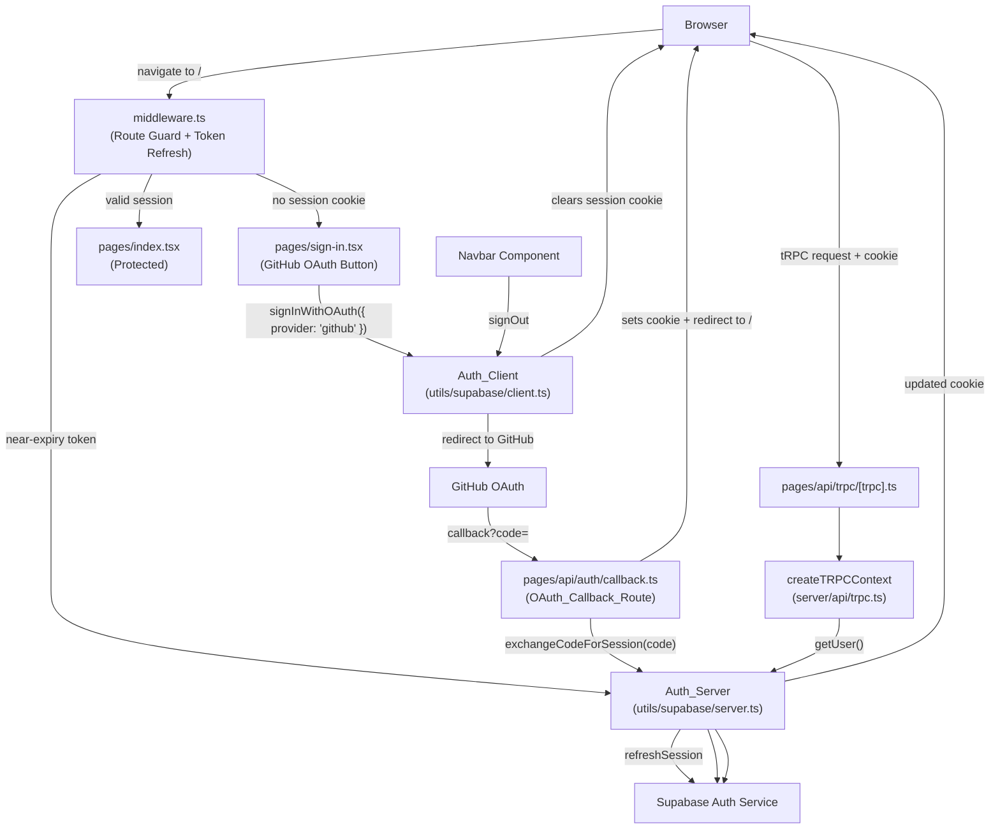

# Design Document: Supabase Authentication

## Overview

This document describes the technical design for wiring Supabase authentication into the `apps/client` Next.js application (Pages Router). The Supabase SDK and utility clients are already scaffolded — this feature connects them to deliver:

- A GitHub OAuth sign-in page (PKCE flow) with a single "Sign in with GitHub" button
- An OAuth callback route (`/api/auth/callback`) that exchanges the authorization code for a session
- Session cookie management via `@supabase/ssr`
- Next.js Middleware for route protection and proactive token refresh
- Session propagation to tRPC's context with a `protectedProcedure` middleware
- Sign-out via the Navbar

Authentication uses Supabase's GitHub OAuth provider with the PKCE flow.

### Key Design Decisions

**PKCE flow over implicit flow** — The PKCE (Proof Key for Code Exchange) flow is significantly more secure for SSR applications. The authorization code is exchanged server-side in the callback route rather than exposing tokens in the URL fragment. `@supabase/ssr` automatically handles the PKCE code verifier, storing it in a cookie before the redirect and validating it during `exchangeCodeForSession`. This prevents authorization code interception attacks.

**`@supabase/ssr` for cookie management** — Rather than managing session cookies manually, we rely on the cookie handlers built into `createBrowserClient` and `createServerClient`. The browser client automatically sets and refreshes session cookies; the server client reads them. This is the recommended Supabase approach for SSR frameworks and avoids a custom cookie layer.

**Next.js Middleware for route protection** — Middleware runs on every matching request before the page renders. This is the correct place for auth checks in a Pages Router app; server-side `getServerSideProps` guards are a fallback, not the primary mechanism.

**`getUser()` over `getSession()` in server contexts** — `getUser()` validates the JWT against the Supabase Auth server, preventing session spoofing from forged cookies. `getSession()` only reads the cookie without validation and is not safe for authorization decisions.

**tRPC context carries `user | null`** — The tRPC context always resolves, never throws, and always has a typed `user` field. `protectedProcedure` checks this field at the middleware layer, cleanly separating authentication from procedure logic.

**OAuth callback route needs a `req`/`res`-based Supabase client** — The existing `createSupabaseServerClient` in `server.ts` uses `cookies()` from `next/headers`, which is only available in the App Router context (Server Components and Route Handlers). The Pages Router API route at `/api/auth/callback` uses `NextApiRequest`/`NextApiResponse` directly, so a separate factory that accepts `req`/`res` is required for this route.

---

## Architecture



### Request Flow — GitHub OAuth Sign-In

1. Browser navigates to `/` — Middleware runs, finds no session cookie, redirects to `/sign-in`
2. User clicks "Sign in with GitHub" on the Sign-In Page
3. `signInWithOAuth({ provider: 'github', options: { redirectTo: '<origin>/api/auth/callback' } })` is called — browser is redirected to GitHub's authorization page
4. User authorizes the application on GitHub — GitHub redirects to `<origin>/api/auth/callback?code=<auth_code>`
5. `OAuth_Callback_Route` receives the code, calls `exchangeCodeForSession(code)` — session cookies are set
6. Callback route redirects to `/`
7. Middleware runs, finds valid session → serves the page

### Request Flow — Token Refresh

1. Browser navigates to any protected route
2. Middleware calls `supabase.auth.getUser()` which internally checks expiry
3. If the access token expires within 60 seconds, middleware calls `supabase.auth.refreshSession()`
4. New tokens are written into response cookies before the page is served
5. Browser receives updated cookies transparently

---

## Components and Interfaces

### 1. `middleware.ts` (new file at `apps/client/src/middleware.ts`)

The middleware is responsible for two things: route protection and proactive token refresh.

```typescript
// Matcher config — runs on all routes except static assets and _next internals
export const config = {
  matcher: ['/((?!_next/static|_next/image|favicon.ico).*)'],
}
```

**Logic:**

```
isProtectedRoute(path):
  return path === '/' || path.startsWith('/game')

isAuthRoute(path):
  return path === '/sign-in'

middleware(request):
  supabase = createMiddlewareClient(request, response)
  
  // getUser() validates the token AND triggers a refresh if near expiry
  { data: { user }, error } = await supabase.auth.getUser()
  
  if error or !user:
    if isProtectedRoute(request.nextUrl.pathname):
      → redirect to /sign-in (clear any stale cookies via supabase internals)
    else:
      → pass through (allow /sign-in, /api/*, etc.)
  else (user is valid):
    if isAuthRoute(request.nextUrl.pathname):
      → redirect to /
    else:
      → pass through (serve protected route)
  
  // IMPORTANT: always return the response from supabase so updated cookies are written
  return response
```

**Why `getUser()` in middleware handles refresh:** `createServerClient` from `@supabase/ssr` with a middleware-compatible cookie interface (`getAll`/`setAll` on the response) automatically refreshes near-expiry tokens when `getUser()` is called and writes the new tokens to the `response` cookies. We must return this response object for the cookie update to reach the browser.

**Middleware client creation** — The middleware needs its own client factory that can write cookies to the `NextResponse` object. This is distinct from `createSupabaseServerClient` (which uses `next/headers` and is for Server Components/API routes):

```typescript
// utils/supabase/middleware.ts
import { createServerClient } from '@supabase/ssr'
import type { NextRequest, NextResponse } from 'next/server'

export function createMiddlewareClient(request: NextRequest, response: NextResponse) {
  return createServerClient(
    env.NEXT_PUBLIC_SUPABASE_URL,
    env.NEXT_PUBLIC_SUPABASE_PUBLISHABLE_KEY,
    {
      cookies: {
        getAll() { return request.cookies.getAll() },
        setAll(cookiesToSet) {
          // write to both request (for this request) and response (for the browser)
          cookiesToSet.forEach(({ name, value, options }) => {
            request.cookies.set(name, value)
            response.cookies.set(name, value, options)
          })
        },
      },
    }
  )
}
```

### 2. Sign-In Page (`pages/sign-in.tsx`)

The existing file is a stub. It will be replaced with a component that renders a single "Sign in with GitHub" button.

**State:**

| State variable | Type | Purpose |
|---|---|---|
| `isLoading` | `boolean` | Disables button and shows loading indicator while OAuth redirect initiates |
| `errorMessage` | `string \| null` | Error message to display; populated from `router.query.error` on mount |

**On mount behavior:**

If `router.query.error === 'auth-code-error'`, set `errorMessage = "Sign-in failed. Please try again."`. Otherwise `errorMessage` remains `null` and no error is shown.

**Button click handler:**

```
handleSignIn():
  setIsLoading(true)
  await supabase.auth.signInWithOAuth({
    provider: 'github',
    options: {
      redirectTo: `${window.location.origin}/api/auth/callback`
    }
  })
  // Leave isLoading=true — browser will redirect away; no cleanup needed
```

### 3. OAuth Callback Route (`pages/api/auth/callback.ts`) — new file

This Pages Router API route receives the authorization code from GitHub, exchanges it for a session, and redirects appropriately.

```typescript
// pages/api/auth/callback.ts
import type { NextApiRequest, NextApiResponse } from 'next'
import { createSupabaseApiRouteClient } from '@/utils/supabase/server'

export default async function handler(req: NextApiRequest, res: NextApiResponse) {
  const code = req.query.code as string | undefined

  if (code) {
    try {
      const supabase = createSupabaseApiRouteClient(req, res)
      const { error } = await supabase.auth.exchangeCodeForSession(code)
      if (!error) {
        return res.redirect('/')
      }
    } catch {
      // fall through to error redirect
    }
  }

  return res.redirect('/sign-in?error=auth-code-error')
}
```

**`createSupabaseApiRouteClient`** — This is a new export added to `utils/supabase/server.ts` alongside the existing `createSupabaseServerClient`. It accepts `NextApiRequest` and `NextApiResponse` and reads/writes cookies from those objects directly, bypassing `next/headers`:

```typescript
// utils/supabase/server.ts (addition)
import type { NextApiRequest, NextApiResponse } from 'next'

export function createSupabaseApiRouteClient(
  req: NextApiRequest,
  res: NextApiResponse
) {
  return createServerClient(
    env.NEXT_PUBLIC_SUPABASE_URL,
    env.NEXT_PUBLIC_SUPABASE_PUBLISHABLE_KEY,
    {
      cookies: {
        getAll() {
          return Object.entries(req.cookies).map(([name, value]) => ({
            name,
            value: value ?? '',
          }))
        },
        setAll(cookiesToSet) {
          cookiesToSet.forEach(({ name, value, options }) => {
            res.setHeader(
              'Set-Cookie',
              `${name}=${value}; Path=${options?.path ?? '/'}; HttpOnly; SameSite=Lax${options?.maxAge ? `; Max-Age=${options.maxAge}` : ''}`
            )
          })
        },
      },
    }
  )
}
```

Note: using a proper cookie serialization library (e.g. `cookie`) is preferable in production to `setAll` — this is illustrative.

### 4. `createTRPCContext` (`server/api/trpc.ts`) — update existing

The current implementation uses `getClaims` (non-existent) and doesn't await properly. It needs to be corrected to use `getUser()`:

```typescript
export async function createTRPCContext({ req, res }: {
  req: NextApiRequest;
  res: NextApiResponse;
}) {
  let user: User | null = null;
  
  try {
    const supabase = await createSupabaseServerClient();
    const { data } = await supabase.auth.getUser();
    user = data.user ?? null;
  } catch {
    // Any exception → user stays null, never propagates
    user = null;
  }

  return { user };
}
```

The `supabase` client itself does not need to be returned in context — procedures should not call Supabase directly; they go through tRPC routers which use their own server client if needed.

### 5. `protectedProcedure` — no structural change needed

The existing `protectedProcedure` in `trpc.ts` already correctly checks `ctx.user` and throws `UNAUTHORIZED`. Once `createTRPCContext` is fixed to populate `user` correctly from `getUser()`, the protected procedure works as intended.

```typescript
export const protectedProcedure = t.procedure
  .use(timingMiddleware)
  .use(({ ctx, next }) => {
    if (!ctx.user) {
      throw new TRPCError({ code: 'UNAUTHORIZED' });
    }
    return next({ ctx: { ...ctx, user: ctx.user } });
  });
```

### 6. Navbar (`components/navigation/navbar.tsx`) — update existing

The current `hijackSignOut` stub only navigates; it needs to call `supabase.auth.signOut()` first.

```typescript
const handleSignOut = async () => {
  setIsSigningOut(true);
  try {
    const supabase = createClient(); // browser client
    await supabase.auth.signOut();
  } finally {
    // redirect regardless of error per requirement 6.4
    router.push('/sign-in');
  }
};
```

The button gets a `disabled={isSigningOut}` prop. The `isSigningOut` state is local to the component.

---

## Data Models

### Session Cookie

Managed entirely by `@supabase/ssr`. The library stores the session as one or more `sb-*` cookies (split if the JWT exceeds cookie size limits). The application code never reads or writes these cookies directly.

| Cookie name | Set by | Read by |
|---|---|---|
| `sb-<project-ref>-auth-token` | `OAuth_Callback_Route` (via `exchangeCodeForSession`) | `createServerClient` in middleware and tRPC context |
| (refresh token variant) | `OAuth_Callback_Route` / middleware on refresh | Same |

### tRPC Context Type

```typescript
type Context = {
  user: User | null; // import { User } from '@supabase/supabase-js'
}
```

### Sign-In Page State

```typescript
type SignInPageState = {
  isLoading: boolean;
  errorMessage: string | null;
}
```

### Protected Procedure Context

After passing the `protectedProcedure` middleware, `ctx.user` is narrowed to `User` (non-nullable):

```typescript
type ProtectedContext = Context & { user: User }
```

---

## Correctness Properties

*A property is a characteristic or behavior that should hold true across all valid executions of a system — essentially, a formal statement about what the system should do. Properties serve as the bridge between human-readable specifications and machine-verifiable correctness guarantees.*

**Prework reflection — eliminating redundancy:**

- 1.4 and 1.5 are the positive and negative cases of the same property (error param present/absent → message shown/hidden). Merged into one property.
- 3.1 and 3.2 both describe "callback failure of any kind → redirect to /sign-in?error=auth-code-error". Merged into one property.
- 4.2 (unauthenticated → redirect) and 7.1 (authenticated → page served) are the two sides of the same access-control property. Merged into one.
- 5.2 (no session → user=null) and 5.5 (exception → user=null) are edge cases of the 5.1 property — the generator for 5.1 already includes null and exception cases.
- 5.3 (null user → UNAUTHORIZED) and 5.4 (non-null user → passes through) are two cases of one property. Merged.

After reflection, 9 unique properties remain.

---

### Property 1: signInWithOAuth is always called with the correct provider and redirectTo

*For any* origin URL string, when the "Sign in with GitHub" button is clicked, `Auth_Client.auth.signInWithOAuth` SHALL be called with `{ provider: 'github', options: { redirectTo: '<origin>/api/auth/callback' } }` where `<origin>` is `window.location.origin` at the time of the click.

**Validates: Requirements 1.2**

---

### Property 2: Error message is shown if and only if error=auth-code-error is in the URL

*For any* URL query string, the Sign-In Page SHALL display "Sign-in failed. Please try again." if and only if the query string contains `error=auth-code-error`. For any other query string (including no query string), no error message SHALL be displayed.

**Validates: Requirements 1.4, 1.5, 3.3**

---

### Property 3: OAuth callback failure always redirects to /sign-in?error=auth-code-error

*For any* callback request where the `code` query parameter is absent, or where `exchangeCodeForSession` returns an error or throws an exception, the `OAuth_Callback_Route` SHALL redirect the user to `/sign-in?error=auth-code-error` and SHALL NOT redirect to `/`.

**Validates: Requirements 3.1, 3.2**

---

### Property 4: Middleware route classification is consistent with the protected-route predicate

*For any* URL path string `p`:
- `isProtectedRoute(p)` returns `true` if and only if `p === '/'` or `p.startsWith('/game')`
- `isProtectedRoute(p)` returns `false` for all paths starting with `/api` and all other paths

**Validates: Requirements 4.1, 4.4**

---

### Property 5: Unauthenticated requests to protected routes are redirected; authenticated requests are served

*For any* protected path (matching the predicate in Property 4):
- A request with no valid session SHALL result in a redirect to `/sign-in`
- A request with a valid session SHALL result in the page being served (no redirect)

**Validates: Requirements 4.2, 7.1**

---

### Property 6: Session token refresh fires for tokens expiring within 60 seconds

*For any* authenticated request where the session's access token has fewer than 60 seconds remaining before expiry, the Middleware SHALL call `supabase.auth.refreshSession()` (or trigger it implicitly via `getUser()`) and SHALL write updated session cookies to the response before returning.

*For any* authenticated request where the session's access token has 60 or more seconds remaining, the Middleware SHALL NOT trigger a token refresh.

**Validates: Requirements 2.4, 7.2**

---

### Property 7: createTRPCContext always resolves with user matching getUser() output — and never throws

*For any* return value from `Auth_Server.auth.getUser()` (including `{ data: { user: <User> } }`, `{ data: { user: null } }`, and thrown exceptions), `createTRPCContext` SHALL resolve (never throw) and `ctx.user` SHALL equal the returned `User` object if present, or `null` otherwise.

**Validates: Requirements 5.1, 5.2, 5.5**

---

### Property 8: protectedProcedure throws UNAUTHORIZED for any null-user context, and passes through for any non-null user

*For any* tRPC context where `user` is `null`, invoking a `protectedProcedure` SHALL throw a `TRPCError` with code `'UNAUTHORIZED'`.

*For any* tRPC context where `user` is a non-null `User` object, the procedure handler SHALL receive that exact user object via `ctx.user`.

**Validates: Requirements 5.3, 5.4**

---

### Property 9: Sign-out always redirects to /sign-in regardless of outcome

*For any* result from `supabase.auth.signOut()` (success, error with any message, or thrown exception), the Navbar sign-out handler SHALL call `router.push('/sign-in')` exactly once.

**Validates: Requirements 6.4**

---

## Error Handling

### Sign-In Page Errors

| Error condition | User-visible behavior |
|---|---|
| `error=auth-code-error` in URL on page load | Displays "Sign-in failed. Please try again." message |
| No `error` parameter in URL | No error message displayed |
| `signInWithOAuth` rejects unexpectedly | Remain on sign-in page; isLoading is left true (browser redirect did not occur) |

### OAuth Callback Route Errors

| Error condition | Behavior |
|---|---|
| No `code` query parameter | Redirect to `/sign-in?error=auth-code-error` |
| `exchangeCodeForSession` returns an error | Redirect to `/sign-in?error=auth-code-error` |
| `exchangeCodeForSession` throws an exception | Redirect to `/sign-in?error=auth-code-error` |
| Successful exchange | Redirect to `/` |

### Middleware Errors

| Error condition | Behavior |
|---|---|
| No session cookie on protected route | Redirect to `/sign-in` |
| Expired/invalid/malformed refresh token | Clear session cookies, redirect to `/sign-in` |
| Supabase auth service unavailable during refresh | Clear session cookies, redirect to `/sign-in` |
| Valid session on `/sign-in` | Redirect to `/` |

Middleware should wrap the `getUser()` / `refreshSession()` call in a try-catch. Any exception from the Supabase client should be treated as an invalid session.

### tRPC Context Errors

`createTRPCContext` wraps the `getUser()` call in a try-catch and sets `user = null` on any exception. This prevents auth service outages from crashing all API requests — public procedures continue to work and protected procedures return `UNAUTHORIZED` rather than a 500.

### Sign-Out Errors

Sign-out uses a `finally` block for the redirect, so the user always lands on `/sign-in` even if `signOut()` rejects. This matches Requirement 6.4 and is the correct UX (a failed sign-out still means the local session is in an uncertain state — best to return to the sign-in page).

---

## Testing Strategy

The project uses TypeScript with Biome as the linter/formatter. There is no test runner currently configured. **Vitest** is the recommended choice — it's fast, compatible with the existing TypeScript/ESM setup, and has excellent integration with the testing patterns needed here.

For property-based testing, **fast-check** is the recommended library. It integrates directly with Vitest, supports TypeScript natively, and has a rich set of arbitraries for generating strings, objects, URLs, and numeric ranges.

### Test Setup

Install dev dependencies in `apps/client`:

```
vitest @vitest/coverage-v8 fast-check @testing-library/react @testing-library/user-event jsdom
```

Add to `package.json` scripts:
```json
"test": "vitest --run",
"test:watch": "vitest"
```

Add `vitest.config.ts`:
```typescript
import { defineConfig } from 'vitest/config'
import path from 'path'

export default defineConfig({
  test: {
    environment: 'jsdom',
    globals: true,
  },
  resolve: {
    alias: { '@': path.resolve(__dirname, './src') },
  },
})
```

### Unit Tests (example-based)

These cover specific, concrete scenarios that don't benefit from input randomization:

- **Sign-In Page renders the GitHub button** — a button with text "Sign in with GitHub" exists in the DOM (Requirement 1.1)
- **Loading state disables button** — while `isLoading=true`, the button is disabled and a loading indicator is shown (Requirement 1.3)
- **Authenticated request to /sign-in redirects to /** — middleware redirects an authenticated user away from the sign-in page (Requirement 4.3)
- **Navbar renders Sign Out button** — button is visible and enabled (Requirement 6.1)
- **Sign Out disables button while in progress** — button becomes disabled immediately on click (Requirement 6.2)
- **Sign Out success redirects to /sign-in** — on successful `signOut()`, `router.push('/sign-in')` is called (Requirement 6.3)
- **Callback route redirects to / on success** — mock `exchangeCodeForSession` returning no error, verify `res.redirect('/')` called (Requirement 2.2)
- **Callback route redirects to /sign-in?error=auth-code-error when code is missing** — call handler with no `code` param, verify redirect target (Requirement 3.1)
- **Callback route redirects to /sign-in?error=auth-code-error when exchange fails** — mock `exchangeCodeForSession` returning an error, verify redirect target (Requirement 3.2)

### Property-Based Tests

Each property test runs a minimum of **100 iterations**. Tag format for each test:
`// Feature: supabase-auth, Property {N}: {property_text}`

**Property 1** — `fc.webUrl()` (or `fc.string()` filtered to valid URL origins) → simulate button click, verify `signInWithOAuth` called with `provider='github'` and `redirectTo` equal to `${origin}/api/auth/callback`.

**Property 2** — `fc.oneof(fc.constant('auth-code-error'), fc.string())` as the `error` query param value → verify error message shown iff value is `'auth-code-error'`.

**Property 3** — `fc.oneof(fc.constant(undefined), fc.record({ message: fc.string(), status: fc.integer({ min: 400, max: 599 }) }))` as code/exchange result → verify redirect is always `/sign-in?error=auth-code-error` for any failure.

**Property 4** — `fc.string()` as path → verify `isProtectedRoute` returns true iff path is `/` or starts with `/game`. Pure function test, no mocking required.

**Property 5** — Protected paths × `{ authenticated: boolean }` → verify redirect to `/sign-in` for unauthenticated, pass-through for authenticated.

**Property 6** — `fc.integer({ min: 0, max: 120 })` as seconds-to-expiry → verify refresh fires iff value < 60.

**Property 7** — `fc.oneof(fc.record({ id: fc.uuid(), email: fc.emailAddress() }), fc.constant(null))` as mock `getUser()` return → verify `ctx.user` matches and `createTRPCContext` never throws.

**Property 8** — `fc.oneof(fc.record({ id: fc.uuid(), email: fc.emailAddress() }), fc.constant(null))` → verify UNAUTHORIZED thrown for null, user threaded through for non-null.

**Property 9** — `fc.oneof(fc.constant({ error: null }), fc.record({ error: fc.record({ message: fc.string() }) }), fc.constant(new Error('network failure')))` as sign-out result → verify `router.push('/sign-in')` always called exactly once.

### Integration Tests

These require a real (or locally mocked) Supabase instance and are out of scope for the unit test suite. They should be run in a dedicated integration environment:

- Complete GitHub OAuth flow → session cookie set and readable server-side (Requirement 2.3)
- Valid session cookie on protected route → page served without redirect (Requirement 7.1)
- Expired session cookie → redirect to `/sign-in` (Requirement 7.3)
