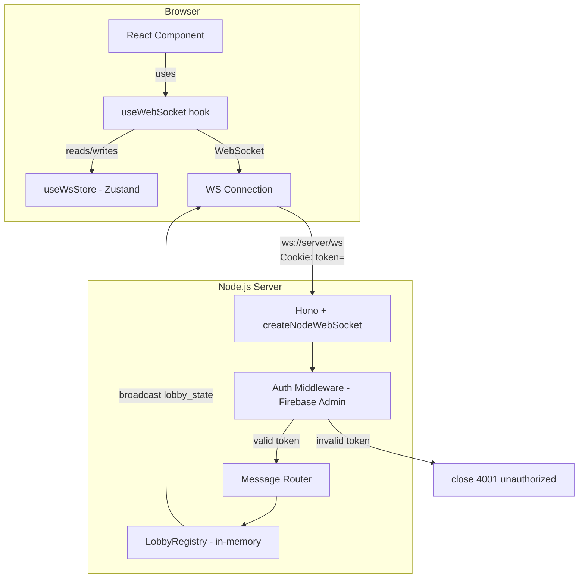

# Design Document: WebSocket Scaffolding

## Overview

This document describes the technical design for the WebSocket scaffolding layer in Final Word — a multiplayer word game. The scaffolding provides a type-safe, authenticated real-time communication channel between the Next.js client and the Hono/Node.js server. It is intentionally minimal: it establishes the transport, message protocol, and connection lifecycle so that game features (e.g. Battle Royale lobbies) can build on top without touching raw WebSocket primitives.

Key design goals:
- Correct Node.js WebSocket adapter (replacing the current `hono/deno` import)
- Shared discriminated-union message types in `packages/types`
- Firebase token authentication on the upgrade handshake
- A `useWebSocket` React hook with reconnection and message queuing
- A Zustand slice that exposes connection state globally

---

## Architecture



The server is a single Hono app. WebSocket upgrade is handled by `createNodeWebSocket` from `@hono/node-server`. An auth middleware validates the Firebase ID token before the upgrade completes. Accepted connections are registered in an in-memory `LobbyRegistry`. Incoming messages are dispatched to typed handlers.

The client is a Next.js app. The `useWebSocket` hook owns the raw `WebSocket` object and drives a Zustand slice (`useWsStore`). Components read state from the store and call `sendMessage` without touching the hook directly.

---

## Components and Interfaces

### Server

#### `createNodeWebSocket` adapter (`apps/server/src/index.ts`)

Replace the current `upgradeWebSocket` from `hono/deno` with the Node.js-specific helper:

```typescript
import { createNodeWebSocket } from '@hono/node-server/ws'

const { injectWebSocket, upgradeWebSocket } = createNodeWebSocket({ app })
```

`injectWebSocket` must be called with the HTTP server instance returned by `serve`.

#### Auth Middleware (`apps/server/src/middleware/auth.ts`)

Runs before the WebSocket upgrade. Reads the `token` cookie, verifies the Firebase ID token via Firebase Admin SDK, and attaches the decoded token to the Hono context. Rejects with HTTP 401 / WS close 4001 on failure.

```typescript
// Hono middleware signature
async (c, next) => {
  const cookie = c.req.header('cookie') ?? ''
  const token = cookie.split(';').find(s => s.trim().startsWith('token='))?.split('=')[1]
  if (!token) return c.text('unauthorized', 401)
  try {
    const decoded = await adminAuth.verifyIdToken(token)
    c.set('uid', decoded.uid)
    await next()
  } catch {
    return c.text('unauthorized', 401)
  }
}
```

#### Message Router (`apps/server/src/ws/router.ts`)

Receives a parsed `ServerMessage`, dispatches to the appropriate handler, and returns an optional `ClientMessage` to send back.

```typescript
function routeMessage(
  msg: ServerMessage,
  conn: Connection,
  registry: LobbyRegistry
): ClientMessage | null
```

#### LobbyRegistry (`apps/server/src/ws/lobbyRegistry.ts`)

In-memory map from `lobbyId` to a `Set<Connection>`. Provides:

```typescript
interface LobbyRegistry {
  join(lobbyId: string, conn: Connection): void
  leave(lobbyId: string, conn: Connection): void
  removeAll(conn: Connection): void          // called on close
  broadcast(lobbyId: string, msg: ClientMessage): void
}
```

#### Connection type

```typescript
interface Connection {
  uid: string
  ws: WSContext  // from hono/ws
}
```

---

### Shared Types (`packages/types/src/ws.ts`)

All message types live here so both client and server import from the same source.

```typescript
// Messages sent FROM the client TO the server
export type ServerMessage =
  | { type: 'ping' }
  | { type: 'join_lobby'; lobbyId: string }
  | { type: 'leave_lobby'; lobbyId: string }

// Messages sent FROM the server TO the client
export type ClientMessage =
  | { type: 'pong' }
  | { type: 'error'; reason: string }
  | { type: 'lobby_state'; lobbyId: string; members: string[] }

// Union of all messages (useful for onMessage callbacks)
export type WsMessage = ServerMessage | ClientMessage
```

Serialization helpers:

```typescript
export function serializeMessage(msg: WsMessage): string {
  return JSON.stringify(msg)
}

export function parseMessage(raw: string): WsMessage {
  // parse + validate with zod schema, throw on invalid
}
```

Zod is already a client dependency; it will be added to `packages/types` as well.

---

### Client

#### `useWebSocket` hook (`apps/client/src/hooks/useWebSocket.ts`)

```typescript
interface UseWebSocketConfig {
  url: string
  onMessage?: (msg: ClientMessage) => void
}

interface UseWebSocketReturn {
  status: 'connecting' | 'open' | 'closing' | 'closed'
  send: (msg: ServerMessage) => void
}

function useWebSocket(config: UseWebSocketConfig): UseWebSocketReturn
```

Responsibilities:
- Opens a `WebSocket` on mount, closes on unmount
- Relies on the browser automatically sending the HttpOnly `token` cookie on the WebSocket upgrade request — no manual token injection needed
- Reconnects with exponential backoff on unexpected close (max 5 retries)
- Queues outbound messages while `status !== 'open'`, flushes on open
- Calls `onMessage` with validated `ClientMessage` on each incoming frame
- Syncs `status` and `lastMessage` into `useWsStore`

#### `useWsStore` Zustand slice (`apps/client/src/state/useWsStore.ts`)

```typescript
interface WsState {
  status: 'connecting' | 'open' | 'closing' | 'closed'
  lastMessage: ClientMessage | null
  sendMessage: (msg: ServerMessage) => void
  // internal
  _setSend: (fn: (msg: ServerMessage) => void) => void
  _setStatus: (s: WsState['status']) => void
  _setLastMessage: (m: ClientMessage) => void
}
```

`sendMessage` delegates to the `send` function registered by `useWebSocket` via `_setSend`. Components import `useWsStore` directly; they never need to import `useWebSocket`.

---

## Data Models

### Message Schema (Zod)

```typescript
import { z } from 'zod'

const ServerMessageSchema = z.discriminatedUnion('type', [
  z.object({ type: z.literal('ping') }),
  z.object({ type: z.literal('join_lobby'), lobbyId: z.string() }),
  z.object({ type: z.literal('leave_lobby'), lobbyId: z.string() }),
])

const ClientMessageSchema = z.discriminatedUnion('type', [
  z.object({ type: z.literal('pong') }),
  z.object({ type: z.literal('error'), reason: z.string() }),
  z.object({
    type: z.literal('lobby_state'),
    lobbyId: z.string(),
    members: z.array(z.string()),
  }),
])

export const WsMessageSchema = z.union([ServerMessageSchema, ClientMessageSchema])
```

### In-Memory Lobby State

```typescript
// LobbyRegistry internal structure
Map<lobbyId: string, Set<Connection>>
```

No persistence. State is lost on server restart. This is intentional per requirements.

### Reconnection State (hook-local)

```typescript
// Managed inside useWebSocket, not exposed to Zustand
let retryCount = 0          // 0–5
let retryTimeout: ReturnType<typeof setTimeout> | null = null
// backoff: 1s, 2s, 4s, 8s, 16s (2^retryCount seconds)
```

---


## Correctness Properties

*A property is a characteristic or behavior that should hold true across all valid executions of a system — essentially, a formal statement about what the system should do. Properties serve as the bridge between human-readable specifications and machine-verifiable correctness guarantees.*

### Property 1: Message round-trip

*For any* valid `WsMessage` object, serializing it with `serializeMessage` and then parsing the result with `parseMessage` should produce an object deeply equal to the original.

**Validates: Requirements 2.4, 2.5, 2.7**

---

### Property 2: Invalid payload produces error

*For any* string that is not a valid `WsMessage` (e.g. random JSON, unknown `type` values, missing required fields), passing it to `parseMessage` should throw, and the server/client handler should respond with an `error` message containing a non-empty `reason` string.

**Validates: Requirements 2.6, 3.5**

---

### Property 3: Ping produces pong

*For any* connection that has completed the auth handshake, sending a `ping` message should result in exactly one `pong` message being returned on the same connection.

**Validates: Requirements 3.1**

---

### Property 4: Join then leave is a round-trip

*For any* connection and any `lobbyId`, after the connection joins a lobby and then leaves it, the lobby's member set should be identical to what it was before the join.

**Validates: Requirements 3.2, 3.3**

---

### Property 5: Connection close removes from all lobbies

*For any* connection that is a member of one or more lobbies, closing that connection should result in the connection being absent from every lobby's member set.

**Validates: Requirements 3.4**

---

### Property 6: Lobby membership change broadcasts to all members

*For any* lobby with N members, when a membership change occurs (join or leave), all N current members of that lobby should receive a `lobby_state` message reflecting the updated member list.

**Validates: Requirements 3.6**

---

### Property 7: Auth token validation

*For any* WebSocket upgrade request, a request where the browser sends a valid Firebase ID token in the `token` cookie should be accepted (handshake completes), and a request with a missing or invalid `token` cookie should be rejected with WebSocket close code `4001` and reason `"unauthorized"`.

**Validates: Requirements 4.3, 4.4**

---

### Property 8: Received messages invoke callback and update store

*For any* valid `ClientMessage` delivered over the WebSocket, the `onMessage` callback passed to `useWebSocket` should be invoked with the parsed message, and the `lastMessage` field in `useWsStore` should equal that same message.

**Validates: Requirements 5.5, 6.3**

---

### Property 9: Reconnection uses exponential backoff

*For any* sequence of unexpected connection closes (up to 5), the delay before each reconnection attempt should be `2^retryCount` seconds (1s, 2s, 4s, 8s, 16s), and no further reconnection should be attempted after 5 failures.

**Validates: Requirements 5.6**

---

### Property 10: Message queue flushes on open

*For any* sequence of messages sent while the connection status is not `open`, once the connection transitions to `open`, all queued messages should be sent in the original order and the queue should be empty.

**Validates: Requirements 5.8**

---

### Property 11: Status changes sync to Zustand store

*For any* connection status transition (`connecting` → `open` → `closing` → `closed`), the `status` field in `useWsStore` should reflect the new status synchronously after the transition occurs.

**Validates: Requirements 6.2**

---

## Error Handling

| Scenario | Behavior |
|---|---|
| Missing or invalid auth token on upgrade | Server reads `token` cookie; returns HTTP 401 before upgrade; if upgrade already started, close with code 4001, reason `"unauthorized"` |
| Malformed JSON payload | Receiver calls `parseMessage`, catches the Zod error, sends `{ type: 'error', reason: 'invalid_message' }`, discards the frame |
| Unknown `type` field | `routeMessage` returns `{ type: 'error', reason: 'unknown_message_type' }` |
| Connection drops unexpectedly | `useWebSocket` schedules reconnect with exponential backoff; status transitions to `connecting` |
| Max retries exceeded (5) | Status transitions to `closed`; no further reconnect; store reflects `closed` |
| `send` called while not open | Message is pushed to the outbound queue; flushed when connection opens |
| Server-side unhandled exception in handler | Handler is wrapped in try/catch; sends `{ type: 'error', reason: 'internal_server_error' }` and logs the error |

---

## Testing Strategy

### Dual Testing Approach

Both unit tests and property-based tests are required. They are complementary:

- **Unit tests** cover specific examples, integration points, and error conditions
- **Property tests** verify universal invariants across randomly generated inputs

### Property-Based Testing Library

Use **[fast-check](https://github.com/dubzzz/fast-check)** for both client and server. It is framework-agnostic, works with Vitest/Jest, and has first-class TypeScript support.

Add to both `apps/server` and `packages/types`:
```
pnpm add -D fast-check
```

### Property Test Configuration

- Minimum **100 runs** per property (fast-check default is 100; keep it)
- Each property test must include a comment tag in the format:
  `// Feature: websocket-scaffolding, Property N: <property_text>`

### Property Tests (one test per property)

| Property | Test location | What to generate |
|---|---|---|
| P1: Message round-trip | `packages/types/src/__tests__/ws.property.test.ts` | Arbitrary `WsMessage` using fast-check arbitraries |
| P2: Invalid payload → error | `packages/types/src/__tests__/ws.property.test.ts` | Random strings, objects with wrong `type` |
| P3: Ping → pong | `apps/server/src/__tests__/router.property.test.ts` | Mock connections |
| P4: Join/leave round-trip | `apps/server/src/__tests__/lobbyRegistry.property.test.ts` | Random lobbyIds, connection counts |
| P5: Close removes from lobbies | `apps/server/src/__tests__/lobbyRegistry.property.test.ts` | Connections in multiple lobbies |
| P6: Broadcast on membership change | `apps/server/src/__tests__/lobbyRegistry.property.test.ts` | Lobbies with N members |
| P7: Auth validation | `apps/server/src/__tests__/auth.property.test.ts` | Valid/invalid token strings |
| P8: Received message → callback + store | `apps/client/src/__tests__/useWebSocket.property.test.ts` | Arbitrary `ClientMessage` values |
| P9: Reconnection backoff | `apps/client/src/__tests__/useWebSocket.property.test.ts` | Retry counts 0–5 |
| P10: Queue flushes on open | `apps/client/src/__tests__/useWebSocket.property.test.ts` | Sequences of messages |
| P11: Status syncs to store | `apps/client/src/__tests__/useWsStore.property.test.ts` | Status transition sequences |

### Unit Tests

Focus on:
- Server starts and listens on the configured port (Req 1.2)
- WebSocket upgrade succeeds for a valid client (Req 1.3)
- HTTP 400 on bad upgrade (Req 1.4)
- All six `MessageType` values parse correctly (Req 2.3)
- Hook mounts and opens connection (Req 5.2)
- Hook unmounts and closes connection cleanly (Req 5.3)
- `send` serializes before transmission (Req 5.4)
- Token refresh updates cookie and triggers reconnect (Req 4.5)
- `useWsStore` has correct initial shape (Req 6.1)
- `sendMessage` action delegates to hook's `send` (Req 6.4)

Use **Vitest** for both unit and property tests (already compatible with the monorepo's TypeScript setup).
